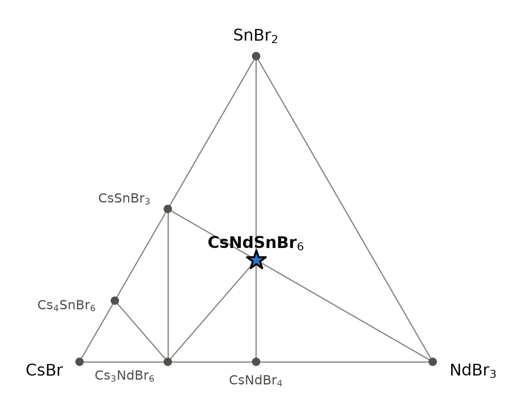
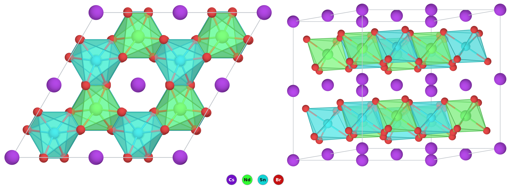

# CsNdSnBr₆ — a layered tin(II) neodymium bromide that nobody seems to have made

*A Material a Day · entry 1 · 8 October 2026 · status: **predicted, no report found***

> **In one paragraph.** CsNdSnBr₆ is a computed compound from the Alexandria database.
> It takes the colquiriite (LiCaAlF₆) structure: honeycomb layers of edge-sharing NdBr₆
> and SnBr₆ octahedra, held together by caesium. It is one member of a family, CsLnSnBr₆,
> of which nine or ten rare-earth members sit on the computed convex hull. Whether it is
> really stable is **not resolved**: one set of calculations puts it 15 meV/atom below its
> competitors and another 4 meV/atom above, and both numbers are smaller than the error
> such calculations carry for halides. The synthesis to try is unglamorous: CsBr, NdBr₃
> and SnBr₂ in a sealed ampoule at 450–500 °C. A black product means it failed.

Everything below is computed unless a reference is given. Read the section
[How this could be wrong](#8-how-this-could-be-wrong) before using any of it.

## 1. Identity

| | |
|---|---|
| Formula | CsNdSnBr₆ |
| Alexandria id | `agm063329412` (PBE table) |
| Space group | P3̄1c (no. 163), Z = 2 |
| Cell (PBE) | a = 7.750 Å, c = 15.732 Å |
| Volume, density | 409.1 ų per formula unit, 3.55 g cm⁻³ |
| Structure type | colquiriite, LiCaAlF₆ (assigned from the site set, see below) |
| Formation energy | −1.528 eV/atom (PBE) |

PBE cells run 0.5–2 % long, so a measured cell should be slightly smaller.
The CIF is [`CsNdSnBr6.cif`](CsNdSnBr6.cif); all numbers are in [`structure.json`](structure.json).

## 2. Where it sits

<picture>
  <source media="(prefers-color-scheme: dark)" srcset="phase_diagram_dark.png">
  
</picture>

The compound has four elements, so the full phase diagram is a tetrahedron. All the
chemistry that matters lies in one plane of it, the section CsBr–NdBr₃–SnBr₂, in which
every phase is a bromide of Cs⁺, Nd³⁺ and Sn²⁺. CsNdSnBr₆ is the 1 : 1 : 1 point at the
centre. The lines are the computed tie lines at 0 K (PBE table); every one of them is
also a tie line of the full four-element hull, so the section is a true pseudo-ternary.

| phase | CsBr : NdBr₃ : SnBr₂ | energy below the corners (meV/atom) |
|---|---|---|
| Cs₄SnBr₆ | 4 : 0 : 1 | 34 |
| CsSnBr₃ | 1 : 0 : 1 | 53 |
| Cs₃NdBr₆ | 3 : 1 : 0 | 51 |
| CsNdBr₄ | 1 : 1 : 0 | 30 |
| **CsNdSnBr₆** | 1 : 1 : 1 | 44 |

- **Neighbours.** CsNdSnBr₆ has tie lines to CsSnBr₃, Cs₃NdBr₆, CsNdBr₄, NdBr₃ and SnBr₂.
  It is the only phase inside the triangle; everything else lies on an edge.
- **The CsBr–NdBr₃ edge depends on the calculation.** The PBE table has Cs₃NdBr₆ and
  CsNdBr₄ on this edge. The Materials-Project-settings table has Cs₃NdBr₆, Cs₂NdBr₅ and
  CsNd₂Br₇ instead, the same three stoichiometries that are reported experimentally
  for the potassium system (K₃NdBr₆, K₂NdBr₅, KNd₂Br₇ [3]). We did not retrieve the
  measured CsBr–NdBr₃ diagram, so which set is right for caesium is open here.
- **The CsBr–SnBr₂ edge** shows the two known caesium tin(II) bromides, CsSnBr₃ and
  Cs₄SnBr₆. CsSn₂Br₅ is not on the computed hull.

## 3. Structure

| site | Wyckoff | x, y, z | coordination |
|---|---|---|---|
| Cs | 2b | 0, 0, 0 | 6 Br at 3.70 Å (octahedron) |
| Nd | 2d | ⅔, ⅓, ¼ | 6 Br at 2.90 Å (octahedron) |
| Sn | 2c | ⅓, ⅔, ¼ | 6 Br at 3.00 Å (octahedron) |
| Br | 12i | 0.627, 0.618, 0.144 | |

- **Layers.** Nd and Sn alternate on a honeycomb net at z = ¼ and ¾. Their octahedra
  share edges (Nd–Sn 4.47 Å), giving a [NdSnBr₆]⁻ sheet. This is the same sheet as in
  BiI₃- or AlCl₃-type trihalides, with the two metal sites ordered.
- **Between the layers.** Cs sits over the empty hexagon of the honeycomb, in an
  octahedron of six Br. Six-fold coordination is low for caesium, which usually takes
  eight to twelve neighbours; this is the weakest point of the structure chemically.
- **Structure type.** The site set (2b, 2d, 2c, 12i in P3̄1c) is that of colquiriite,
  LiCaAlF₆, with Cs on the Ca site, Sn on the Li site and Nd on the Al site.
  Colquiriite-type fluorides are well known [5]; we found no bromide of this type in the
  literature searches below.
- **Tin lone pair.** The Sn²⁺ octahedron is regular, so the 5s² pair is not
  stereochemically active in the calculation, as in cubic CsSnBr₃.
- **Stacking.** A one-layer variant (P312, c = 7.89 Å, `agm005070185`) is degenerate with
  the two-layer one to 0.002 meV/atom. A real sample should therefore show stacking
  faults: sharp *hk*0 lines and broadened or streaked lines with *l* ≠ 0.

**The family.** The same structure is on the PBE hull for Ln = Y, Nd, Pm, Gd, Dy, Ho, Er,
Tm and Lu (Lu in the one-layer stacking), and for Bi. It is 2–9 meV/atom above the hull
for Sc, La, Pr, Sm and Tb. The numbers are in section 5.

## 4. Computed properties

Open-shell 4f compounds are a known weak spot of PBE, and several property tables do not
cover CsNdSnBr₆ itself. Where that is the case the numbers below are for **CsYSnBr₆**
(`agm029293084`), the same structure with yttrium in place of neodymium and no 4f
electrons. They describe the bromide host; the full set is in
[`properties.json`](properties.json).

### Electronic structure

| property | CsNdSnBr₆ | CsYSnBr₆ | comment |
|---|---|---|---|
| Band gap, PBE (eV) | 0.81 | 3.53 (indirect), 3.54 (direct) | The Nd value is an **artefact**: a gap between misplaced 4f states. PBE underestimates the host gap, so read 3.5 eV as a lower bound |
| Band gap, machine-learned (eV) | 3.57 | — | A screening estimate from the structure alone; it agrees with the host gap |
| Magnetic moment (μ_B per Nd, spin only) | 3.0 | 0 | Nd³⁺, 4f³. The measured effective moment of free Nd³⁺ is 3.62 μ_B |

A hybrid-functional or MBJ gap is not available for either compound.

### Dielectric response (CsYSnBr₆)

| property | in the layers | across the layers | average |
|---|---|---|---|
| Electronic dielectric constant ε∞ | 3.40 | 2.69 | 3.16 |
| Refractive index n = √ε∞ | 1.84 | 1.64 | 1.78 |

| Born effective charge | Cs | Y | Sn | Br |
|---|---|---|---|---|
| nominal | +1 | +3 | +2 | −1 |
| in the layers | +1.28 | +4.0 | +3.7 | −0.4 to −2.2 |
| across the layers | +1.72 | +2.0 | +1.9 | (principal values) |

- **Optically uniaxial**, as the trigonal symmetry requires, with a sizeable
  birefringence, Δn ≈ 0.2. PBE overestimates ε∞ somewhat, so the real indices should be
  a little lower.
- **Tin is the polarisable ion.** Its in-plane Born charge (+3.7) is nearly twice the
  nominal +2, the usual signature of a 5s² lone pair that is not stereochemically active
  but is easily deformed.
- **This is ε∞ only.** The static dielectric constant needs the lattice contribution,
  which requires phonons that were not computed. With Born charges this large and a soft
  lattice, the static value will be considerably higher than 3.
- The structure is centrosymmetric, so there is no piezoelectric response.

### Charge transport (CsYSnBr₆, constant relaxation time)

| | electrons | holes |
|---|---|---|
| Density-of-states mass (mₑ) | 7.9 | 5.8 |
| Conductivity mass at 300 K (mₑ) | 4.0 | 12.3 |
| Seebeck coefficient at 300 K, 10¹⁹ cm⁻³ (μV/K) | −511 | +551 |
| Seebeck coefficient at 300 K, 10²⁰ cm⁻³ (μV/K) | −316 | +350 |

- **Carriers are heavy.** Masses of 4 to 12 electron masses mean narrow bands and low
  mobility. This is a wide-gap insulator, not a candidate semiconductor; the large
  Seebeck values are what any flat-band insulator gives and do not make it a
  thermoelectric.
- **Branch-point energy:** 0.81 eV above the valence-band maximum, in a 3.5 eV gap. A
  charge-neutrality level that close to the valence band suggests the compound would
  tolerate holes more easily than electrons, as other tin(II) halides do.
- For CsNdSnBr₆ itself the same table gives masses of 140 to 340 mₑ. Those belong to the
  4f bands that PBE puts at the gap edges and should not be quoted.

### Mechanical (CsNdSnBr₆, machine-learned)

| bulk modulus | shear modulus | Young's modulus |
|---|---|---|
| 16 GPa | 7 GPa | 24 GPa |

These are screening estimates from a graph neural network, not elastic-constant
calculations. They say the expected thing: a soft layered salt, softer than rock salt
(NaCl, about 25 GPa bulk modulus).

### Magnetism

Nd³⁺ ions sit 7.75 Å apart on triangular nets with no shared anion. Any ordering would be
at very low temperature, and the triangular geometry frustrates it. Nothing beyond the
moment was computed.

### Not computed

Phonons and the static dielectric constant, elastic constants, optical spectra,
crystal-field levels, defect energies.

## 5. Is it stable?

| calculation | CsNdSnBr₆ against its competitors |
|---|---|
| PBE table (`energy_runs_pbe`) | on the hull, **15.0 meV/atom below** them |
| PBE, Materials-Project settings (`energy_runs_pbe_mp`) | **3.8 meV/atom above** ½ CsSnBr₃ + ½ CsNd₂Br₇ + ½ SnBr₂ |

The two disagree in sign. Computed formation enthalpies of halides scatter by about
27 meV/atom (median absolute deviation) against calorimetry, so neither number settles
the question. The honest statement is that CsNdSnBr₆ competes on equal terms with a
mixture of CsSnBr₃, CsNd₂Br₇ and SnBr₂, and that an experiment has to decide.

Depth below the competing phases across the family, PBE table, meV/atom (positive =
stable):

| Y | Nd | Pm | Gd | Dy | Ho | Er | Tm | Lu | Sm | Sc | La | Pr | Tb |
|---|---|---|---|---|---|---|---|---|---|---|---|---|---|
| 9.9 | 15.0 | 15.9 | 12.2 | 6.6 | 14.5 | 21.2 | 19.7 | 7.5 | −1.8 | −2.3 | −6.3 | −7.9 | −9.1 |

The scatter along the series (Pr −8 next to Nd +15) is not chemical; it shows how far
the 4f treatment moves these numbers. Read the family as "all marginal, none excluded".
Er and Tm are computed deepest; Y and Lu avoid the 4f problem altogether and are the
cleanest tests of whether the structure type exists.

## 6. How to make it

Energies are 0 K reaction energies in meV per atom of the whole charge, on the
`pbe_mp` scale. They say what is downhill, not what is fast.

| route | charge | ΔE | comment |
|---|---|---|---|
| **A. Binary bromides** | CsBr + NdBr₃ + SnBr₂ | −39 | The route to try first |
| B. From the perovskite | CsSnBr₃ + NdBr₃ | −9 | Two reagents; CsSnBr₃ is also the main competitor, so this starts from the wrong side |
| C. Comproportionation | ½ Cs₂SnBr₆ + ½ Sn + NdBr₃ | −70 | Avoids weighing SnBr₂; Cs₂SnBr₆ is air-stable |
| D. From ternaries | ⅓ Cs₃NdBr₆ + ⅔ NdBr₃ + SnBr₂ | −21 | Pre-reacted Cs/Nd; useful if NdBr₃ purity is the problem |

**Route A in practice (a proposal, not a tested procedure).**

- **Charge:** CsBr : NdBr₃ : SnBr₂ = 1 : 1 : 1, weighed in an argon glovebox.
- **Container:** evacuated, sealed silica ampoule. The calculation finds SiO₂, Al₂O₃,
  BN, graphite, Mo, W and Ni inert towards the product. Avoid Ta and Nb (mild attack),
  Pt and Pd (they alloy with tin), and any basic oxide (CaO, Y₂O₃), which takes the
  neodymium as NdOBr.
- **Temperature:** 450–500 °C for several days, then slow cooling.
  - *Bottom of the window:* SnBr₂ melts at 215 °C and acts as its own flux; the
    Tammann temperature of the most refractory reagent, NdBr₃, is roughly 200 °C.
  - *Top of the window:* SnBr₂ boils at 639 °C and CsBr melts at 637 °C. Above about
    600 °C the ampoule carries a real SnBr₂ pressure and the composition drifts.
- **Atmosphere:** none; oxygen is the main enemy. With O₂ the computed products are
  NdOBr + SnBr₄ + Cs₂SnBr₆ (−276 meV/atom).

**Getting anhydrous NdBr₃.** Commercial NdBr₃ is often partly hydrolysed. The standard
preparation is the ammonium-bromide route of Meyer [1]: Nd₂O₃ with excess NH₄Br, then
decomposition of the ammonium complex under vacuum.

**Metathesis.** We tested it because salt metathesis is often the gentlest way into a
complex halide. Here it does not help:

| charge | computed outcome |
|---|---|
| NdCl₃ + 3 NaBr + CsBr + SnBr₂ | mixed chloride–bromide: CsNd₂Cl₇ forms, NaSnBr₃ takes half the tin |
| NdCl₃ + 3 LiBr + CsSnBr₃ | 3 LiCl + the competing bromides; LiCl is a spectator, but nothing separates it from a water-sensitive product |
| ½ Nd₂O₃ + AlBr₃ + CsBr + SnBr₂ | strongly downhill (−232), leaves ½ Al₂O₃ mixed into the product |

The reason is general for this compound: it is a soft bromide held together by a few
meV/atom, and almost every salt a metathesis throws off exchanges with it. KBr, KCl,
CsCl, RbCl, NaCl and the fluorides all react with it in the calculation; only LiCl and
MgCl₂ are inert. Metathesis is useful one step earlier, for making the NdBr₃.

**Reading the powder pattern.** Strongest computed lines, Cu Kα (measured lines will
sit at slightly higher angle):

| 2θ (°) | 11.25 | 17.37 | 25.63 | 28.93 | 32.44 | 37.24 | 40.31 | 41.59 |
|---|---|---|---|---|---|---|---|---|
| hkl | 002 | 102 | 112 | 202 | 114 | 212 | 300 | 116 |
| I | 32 | 93 | 72 | 17 | 100 | 34 | 42 | 22 |

- **Black or dark product, cubic perovskite lines:** CsSnBr₃ formed and the target did
  not. Together with CsNd₂Br₇ and SnBr₂ this is the competing assemblage.
- **NdOBr lines, or a yellow Cs₂SnBr₆ component:** oxygen or water got in.
- **Target lines with *l* ≠ 0 broad:** stacking faults, expected (section 3).
- **A low-angle line at 11.2° (d ≈ 7.9 Å)** is the layer spacing and the quickest sign
  that a layered phase formed at all.

## 7. What it might be good for

Nothing here is an existing application; the compound has not been made.

- **Scintillator and phosphor hosts.** Colquiriite fluorides (LiCaAlF₆, LiSrAlF₆) are
  established hosts for Ce³⁺ and Eu²⁺, and rare-earth bromides (LaBr₃:Ce, CeBr₃) are
  among the brightest scintillators. The Y, Gd and Lu members of this family would be
  the bromide hosts to dope.
- **Tin(II) luminescence.** Sn²⁺ in a bromide octahedron gives broad self-trapped
  emission in Cs₄SnBr₆ [4]. Here the SnBr₆ octahedra are separated by NdBr₆, which
  raises the question of Sn²⁺ → Nd³⁺ energy transfer.
- **Frustrated magnetism.** A triangular net of well-separated Kramers ions (Nd³⁺,
  Er³⁺) in a cleavable layered halide is the kind of lattice studied for
  low-temperature frustrated magnetism.
- **What counts against it:** Sn²⁺ oxidises in air, the compound will be hygroscopic,
  and caesium and anhydrous rare-earth bromides are expensive. It is a
  glovebox-and-ampoule material.

## 8. How this could be wrong

- **It may not exist.** The stability margin changes sign between two calculations and
  is below the known error for halides (section 5).
- **Caesium may refuse six-fold coordination** and the real phase at this composition
  could have a different structure with a larger Cs site. The database only contains
  the structure types that were tried.
- **Temperature is not in the calculation.** A three-phase mixture and an ordered
  quaternary compound differ in entropy, and the Nd/Sn order on the honeycomb may not
  survive at the firing temperature.
- **The neighbours are computed too.** CsNd₂Br₇ and Cs₃NdBr₆ are taken from the
  database; the CsBr–NdBr₃ system has been studied thermodynamically [2, 3] but we did
  not check its phases one by one against the computed ones.
- **The literature search can miss things.** See below.

## 9. Literature

**Searched (OpenAlex, Crossref, web), 8 October 2026:** `CsNdSnBr6`; `CsLnSnBr6`,
`CsYSnBr6`, `CsGdSnBr6`; "cesium neodymium tin bromide"; "quaternary halides tin(II)
rare earth crystal structure"; "LiCaAlF6 type chlorides bromides quaternary halides";
"CsBr–NdBr3 phase diagram"; `CsNd2Br7`.

**Result:** no report of CsNdSnBr₆ or of any CsLnSnBr₆ compound. A failed search is not
proof of novelty: ternary and quaternary halide chemistry has a large older literature,
much of it German and poorly indexed. **A check against ICSD or Pearson's by a person is
still owed.**

What is known nearby:

1. G. Meyer, S. Dötsch, T. Staffel, "The ammonium-bromide route to anhydrous rare earth
   bromides MBr₃", *J. Less-Common Met.* (1987). doi:10.1016/0022-5088(87)90372-9
   — *title and metadata only.*
2. M. Gaune-Escard, A. Bogacz, L. Rycerz, "Formation enthalpies of MBr–NdBr₃ liquid
   mixtures (M = Li, Na, K, Rb, Cs)", *Thermochim. Acta* (1996).
   doi:10.1016/s0040-6031(96)90058-1 — *metadata only.*
3. Y. Bounouri *et al.*, "Thermodynamic properties of the NdBr₃–MBr binary systems
   (M = Na, K)", *J. Therm. Anal. Calorim.* (2018). doi:10.1007/s10973-018-7180-4
   — *abstract read:* K₃NdBr₆, K₂NdBr₅ and KNd₂Br₇ exist; KNd₂Br₇ melts at 814 K. The
   caesium system is modelled in I. Szczygieł *et al.*, *Calphad* (2016),
   doi:10.1016/j.calphad.2016.04.012 — *metadata only.*
4. Cs₄SnBr₆, CsSnBr₃ and Cs₂SnBr₆ are the known caesium tin bromides; see e.g.
   *RSC Adv.* (2020), doi:10.1039/d0ra04680a — *search summary only.*
5. Colquiriite-type fluorides LiM²⁺M³⁺F₆: structure-type background from search
   summaries; no primary reference opened.

## 10. Provenance

- **Data:** Alexandria database, tables `energy_runs_pbe` (selection, structure,
  properties) and `energy_runs_pbe_mp` (reaction energies, competing phases).
- **Tools:** the reaction-route code of this group (convex hull and reaction table),
  pymatgen for symmetry and the powder pattern.
- **Authorship:** drafted by Claude (Anthropic) from those tools; reviewed by
  Miguel Marques. Corrections are welcome as issues on this repository.
