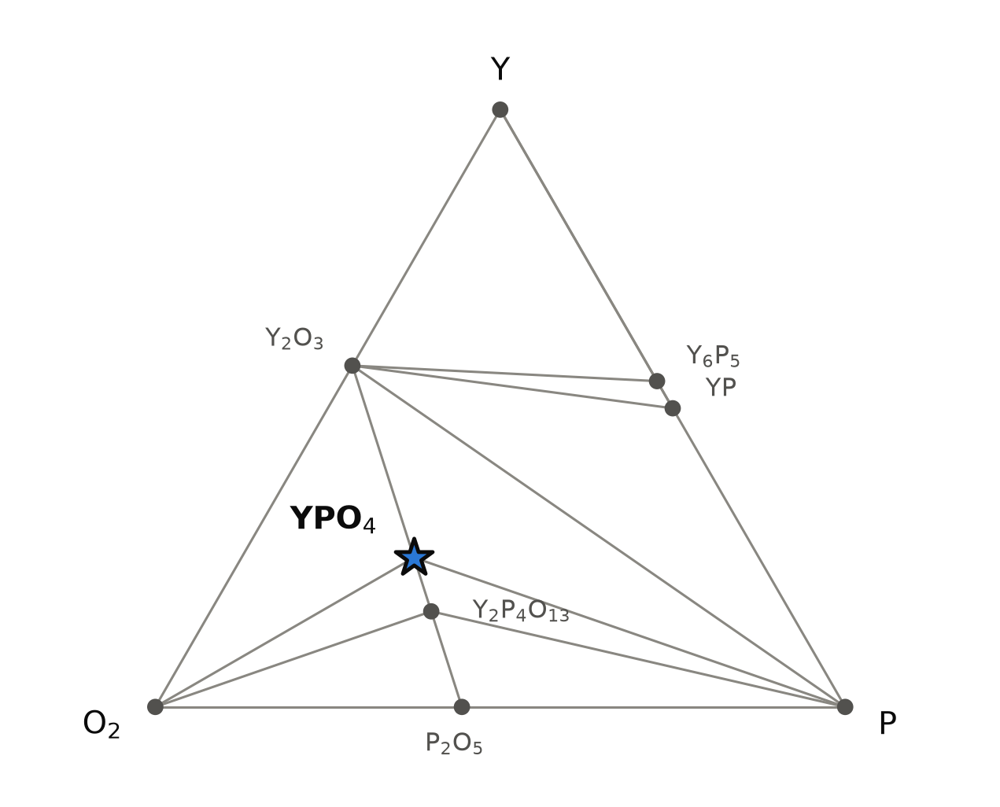
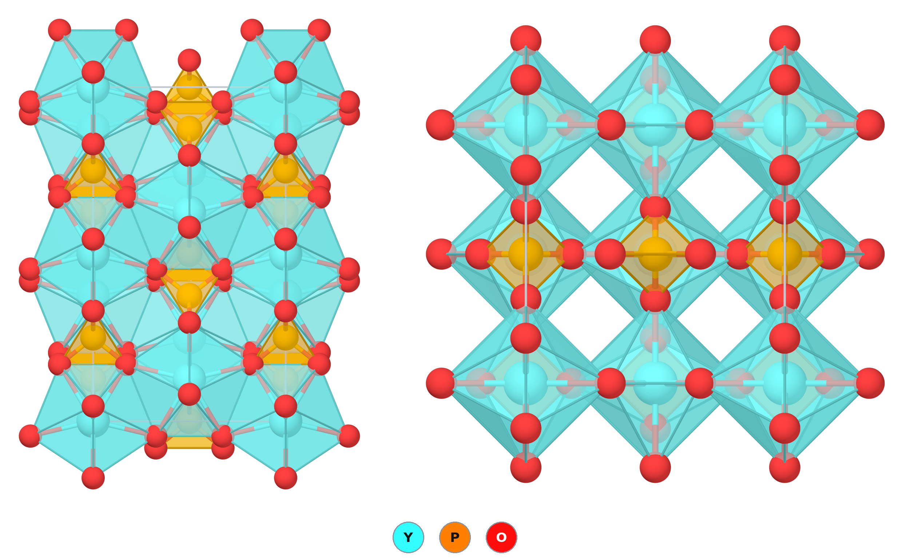

# YPO₄ — xenotime, the zircon-type phosphate that hosts heavy rare earths

*A Material a Day · entry 2 · 9 October 2026 · status: **known** (mineral xenotime-(Y); structure first reported in 1934)*

> **In one paragraph.** YPO₄ is the mineral xenotime: chains of alternating PO₄ tetrahedra
> and YO₈ polyhedra in the zircon structure. It is one of the most stable compounds we
> have looked at, 150–250 meV/atom below everything it could decompose into, it melts
> near 2000 °C, and it is inert towards most crucible materials and molten chlorides. It
> is made by firing Y₂O₃ with an ammonium phosphate, by precipitation, or from a lead
> phosphate flux. It matters as an ore of the heavy rare earths, as a phosphor and
> scintillator host, as a ceramic for nuclear waste, and as a coating in oxide composites.
> The calculations reproduce the cell to about 1 %, the sign and size of the
> birefringence, and the bulk modulus to about 10 %; the band gap is the usual casualty.

Computed numbers come from the Alexandria database; measured numbers carry a reference.

## 1. Identity

| | computed (PBE) | measured |
|---|---|---|
| Formula | YPO₄ | |
| Mineral name | | xenotime-(Y) |
| Alexandria id | `agm002301450` | |
| Space group | I4₁/amd (no. 141), Z = 4 | I4₁/amd [1, 2] |
| a (Å) | 6.961 | 6.8947 (natural) [1]; 6.8817 (synthetic) [2] |
| c (Å) | 6.053 | 6.0276 [1]; 6.0177 [2] |
| Density (g cm⁻³) | 4.16 | |
| Structure type | zircon, ZrSiO₄ | |
| Formation energy | −3.036 eV/atom | |

PBE overestimates a by 1.0–1.2 % and c by 0.4–0.6 %, the usual direction and size.
The mineral has a Wikipedia page: [Xenotime](https://en.wikipedia.org/wiki/Xenotime).
The CIF is [`YPO4.cif`](YPO4.cif); all numbers are in [`structure.json`](structure.json).

## 2. Where it sits

<picture>
  <source media="(prefers-color-scheme: dark)" srcset="phase_diagram_dark.png">
  
</picture>

The Y–P–O triangle at 0 K (PBE table). YPO₄ lies on the line joining Y₂O₃ to P₂O₅, at
the 1 : 1 point, and has tie lines to Y₂O₃, to elemental phosphorus, to oxygen and to
the next phosphate along that line.

| phase | Y₂O₃ : P₂O₅ | comment |
|---|---|---|
| Y₂O₃ | 1 : 0 | |
| **YPO₄** | 1 : 1 | orthophosphate |
| Y₂P₄O₁₃ | 1 : 2 | on the hull in the PBE table only |
| P₂O₅ | 0 : 1 | |

- **The phosphorus-rich side depends on the calculation.** The PBE table has Y₂P₄O₁₃
  between YPO₄ and P₂O₅. The Materials-Project-settings table has YP₃O₉ and YP₅O₁₄
  there instead, the metaphosphate and ultraphosphate stoichiometries. YPO₄ itself is
  on the hull in every table.
- **Tie line to elemental phosphorus.** Under strongly reducing conditions the
  calculation does not reduce YPO₄ to a phosphide directly; it coexists with P and Y₂O₃.
- On the Y–P edge the hull holds YP and Y₆P₅.

## 3. Structure

*Left: seen along a, with the chains running vertically. Right: seen down the chains (c axis).*

| site | Wyckoff | x, y, z | coordination |
|---|---|---|---|
| Y | 4a | 0, 0, 0 | 8 O: four at 2.33 Å and four at 2.39 Å |
| P | 4b | 0, ½, ¼ | 4 O at 1.554 Å (tetrahedron) |
| O | 16h | 0, 0.174, 0.661 | 1 P + 2 Y |

- **Chains.** Each YO₈ polyhedron (a bisdisphenoid, also called a triangular
  dodecahedron) shares two opposite edges with PO₄ tetrahedra, giving straight chains
  …–YO₈–PO₄–YO₈–PO₄–… along c.
- **Between chains.** Neighbouring chains are joined by YO₈ polyhedra sharing edges with
  each other, which makes the framework three-dimensional and leaves empty square
  channels along c, visible in the right-hand view.
- **One oxygen site.** Every oxygen is bonded to one phosphorus and two yttrium atoms.
  This is the feature that distinguishes xenotime from monazite, the structure the
  larger rare earths (La to Gd) take, where the rare earth has nine neighbours and there
  are four different oxygens [3].
- **Other structures of YPO₄ in the database** (energy above xenotime, meV/atom):

  | structure | PBE | PBE (MP settings) | SCAN |
  |---|---|---|---|
  | xenotime, I4₁/amd | 0 | 0 | 0 |
  | hexagonal, P6₂22 (the anhydrous rhabdophane-type framework) | — | 28 | 52 |
  | orthorhombic, Ama2 | 50 | 48 | — |
  | scheelite, I4₁/a | 84 | 82 | 67 |

  All three functionals agree that xenotime is the ground state. Scheelite is the
  dense structure that related xenotime-type phosphates reach under pressure, by way
  of monazite [4].

## 4. Properties

### Electronic structure

| | PBE | SCAN | MBJ | measured |
|---|---|---|---|---|
| Band gap (eV) | 5.90 (indirect), 5.95 (direct) | 6.66 | 7.53 | about 8.6 [5] |

The ordering is the textbook one: PBE too small by a third, SCAN a little better, MBJ
within 1 eV. The compound is non-magnetic and colourless.

### Dielectric response and optics

| | ⊥ c (ordinary) | ∥ c (extraordinary) | average |
|---|---|---|---|
| ε∞, computed | 3.14 | 3.57 | 3.29 |
| Refractive index, computed | 1.77 | 1.89 | 1.81 |
| Refractive index, measured [6] | 1.720 | 1.815 | |

- **Uniaxial positive**, in the calculation and in the mineral. The computed
  birefringence is 0.12 against a measured 0.095.
- The computed indices are 3–4 % too high, as expected from a PBE gap that is too small.
- **Born effective charges:** Y +3.8 to +4.2 (nominal +3), P +3.3 to +4.4 (nominal +5),
  O −1.0 to −2.9 (nominal −2). Phosphorus well below +5 is the mark of the covalent
  P–O bond inside the phosphate group.
- This is the electronic part only; the static dielectric constant was not computed.
- The structure is centrosymmetric: no piezoelectricity.

### Charge transport (constant relaxation time)

| | electrons | holes |
|---|---|---|
| Density-of-states mass (mₑ) | 5.4 | 4.8 |
| Conductivity mass at 300 K (mₑ) | 1.7 | 3.2 |
| Branch-point energy above the valence band (eV) | 2.4 of a 5.9 eV PBE gap | |

A wide-gap insulator with moderately heavy carriers and a charge-neutrality level a
little below mid-gap. Nothing here suggests a use as an electronic material; the
relevance is to how the host accommodates dopants and radiation-induced carriers.

### Mechanical and thermal

| | machine-learned | measured |
|---|---|---|
| Bulk modulus (GPa) | 132 | 148 [7] |
| Shear modulus (GPa) | 61 | |
| Young's modulus (GPa) | 155 | |
| Thermal expansion (10⁻⁶ K⁻¹) | | 6.2 [3] |
| Melting point (°C) | | 1995 ± 20 [8] |

The machine-learned moduli are screening estimates; the bulk modulus comes out 11 %
below the single-crystal measurement.

### Not computed

Phonons (the compound is not in our lattice-dynamics set), the static dielectric
constant, elastic constants, defect and dopant levels.

## 5. Is it stable?

Yes, and by a margin that leaves no doubt.

| calculation | depth below the competing phases (meV/atom) |
|---|---|
| PBE | 154 |
| PBE (MP settings) | 202 |
| SCAN | 255 |

The scatter of computed oxide formation enthalpies against calorimetry is about
65 meV/atom, so even the smallest of these is more than twice the error. The oxygen
potential makes no difference: YPO₄ is the stable phase at its composition over the
whole range scanned, from air down to conditions far more reducing than any furnace gas.

## 6. How to make it

### What is done

| method | reagents | conditions | product | ref. |
|---|---|---|---|---|
| Solid state | RE₂O₃ + NH₄H₂PO₄ | 1250–1350 °C in air, alumina crucible (reported for the monazites) | powder | [3] |
| Precipitation | RE oxide or nitrate + H₃PO₄ | reflux at 130 °C, then drying and calcination | fine powder | [3] |
| Flux growth | Y₂O₃ + PbHPO₄ (forms Pb₂P₂O₇) | 1357 °C in platinum, cooled at 1 °C/h to 897 °C | single crystals | [3] |
| Flux growth | Y(NO₃)₃ + NH₄H₂PO₄ in NaHCO₃–MoO₃ | 1375 °C, cooled at 3 °C/h to 870 °C | powder and crystals | [3] |

Crystals from the lead flux carry lead: the widely used rare-earth phosphate
microprobe standards grown this way are measurably contaminated [9].

### What the calculation proposes

Reaction energies at 0 K, meV per atom of the whole charge.

| route | charge | ΔE | comment |
|---|---|---|---|
| A | ½ Y₂O₃ + ½ P₂O₅ | −409 | The same reaction as the solid-state method, with the ammonium phosphate as the P₂O₅ source |
| B | ⅓ Y₂O₃ + ⅓ YP₃O₉ | −202 | Least driving force of the exact routes; a way to correct a phosphorus-rich batch |
| C (metathesis) | YCl₃ + Na₃PO₄ → YPO₄ + 3 NaCl | −198 | Clean in the calculation: the only products are the target and salt |
| D (metathesis) | YF₃ + Li₃PO₄ | −16 | **Fails:** three quarters of the yttrium ends as LiYF₄ |

- **Route C is the solid-state twin of the precipitation method**, and the calculation
  says it should work dry: NaCl does not react with YPO₄ and washes out with water.
  Given the Tammann temperature of YCl₃ and a molten-salt product above 801 °C, a
  firing at 500–800 °C is the range to try. We did not find this dry reaction reported
  for YPO₄ in the searches below, which is not the same as it being unreported.
- **Route D shows the limit:** a fluoride route loses yttrium to LiYF₄, and KF and
  K₂CO₃ attack YPO₄ too, forming K₃Y(PO₄)₂. Sodium and chloride are the safe choices.

### What it tolerates

| inert in the calculation | reacts |
|---|---|
| Pt, Au, Ni, Mo, W | Zr, Ti, Al, Ta, Nb, Si (reduce the phosphate to phosphides or phosphorus) |
| Al₂O₃, ZrO₂, SiO₂, MgO, TiO₂, BN, graphite | CaO (→ Ca₃(PO₄)₂ + Y₂O₃), SiC (→ Y₂Si₂O₇ + P) |
| all alkali chlorides and bromides, CaCl₂, MgCl₂, Na₂SO₄, Na₂CO₃, Na₂MoO₄, Na₂WO₄, PbO, B₂O₃ | KF, K₂CO₃, borax (weakly), LiF (marginally) |

- The inertness towards platinum, the molybdate flux and lead oxide is consistent with
  the two flux-growth recipes above.
- The inertness towards alumina and the reaction with SiC bear on the composite
  application in section 7: the calculation says xenotime belongs with oxide fibres,
  not with silicon carbide.

### Powder pattern

Strongest computed lines, Cu Kα. Measured lines sit about 0.2–0.3° higher because the
real cell is smaller.

| 2θ (°) | 19.43 | 25.59 | 34.80 | 36.51 | 41.69 | 49.56 | 51.32 | 52.59 |
|---|---|---|---|---|---|---|---|---|
| hkl | 101 | 200 | 112 | 220 | 301 | 321 | 312 | 400 |
| I | 22 | 100 | 54 | 14 | 18 | 15 | 48 | 14 |

- **Extra lines of Y₂O₃:** the batch is phosphorus-poor, usually because phosphorus
  left as vapour during firing. Add phosphate and refire.
- **A hydrated, poorly crystalline product after precipitation:** dehydration is
  incomplete; calcine higher.

## 7. What it is used for

- **Source of heavy rare earths.** Natural xenotime carries Y, Gd, Dy and Er and is
  an economic ore of the heavy rare earths [10].
- **Phosphor and scintillator host.** The wide gap and the single, high-symmetry
  rare-earth site make YPO₄ a host for luminescent ions; rare-earth phosphates are
  studied as scintillators and thermophosphors [3], and undoped Y₁₋ₓScₓPO₄ solid
  solutions are bright, thermally stable UV-C emitters [11].
- **Nuclear waste forms.** Monazite and xenotime ceramics take up rare earths, uranium
  and thorium, resist radiation damage, and leach far more slowly than borosilicate
  glass; natural crystals that have held actinides for geological time are the
  analogue [3].
- **Coatings in ceramic composites.** Rare-earth phosphates serve as coatings and weak
  interphases, and their pressure-induced transformations are studied for that
  reason [3, 4].

## 8. How this could be wrong

- **The band gap** is off by 1 to 2.7 eV depending on the functional. Anything that
  depends on it, the refractive indices included, inherits part of that error.
- **The moduli are machine-learned**, not computed from elastic constants.
- **The phosphorus-rich neighbours differ between tables** (Y₂P₄O₁₃ against YP₃O₉ and
  YP₅O₁₄). This does not affect YPO₄ but it does affect what a phosphorus-rich batch
  turns into.
- **Route C is a thermodynamic statement.** It says nothing about rate, and a chloride
  route in air risks YOCl if moisture is present.
- **Natural xenotime is never pure YPO₄**; it is a solid solution with the heavy
  lanthanides, and its measured cell and indices reflect that.

## 9. Literature

**Searched (OpenAlex, Crossref, web), 8 October 2026:** "crystal chemistry of the
monazite and xenotime structures"; "YPO4 xenotime band gap"; "melting points of
monazite and xenotime"; "YPO4 zircon to scheelite high pressure"; "flux growth rare
earth orthophosphate lead pyrophosphate"; "YPO4 elastic constants bulk modulus
refractive index"; "xenotime fiber coating oxide ceramic composites".

1. Y. Ni, J. M. Hughes, A. N. Mariano, "Crystal chemistry of the monazite and xenotime
   structures", *Am. Mineral.* 80, 21 (1995). doi:10.2138/am-1995-1-203 — *cell from
   the COD entry 9001654.*
2. W. O. Milligan *et al.*, "Structural investigations of YPO₄, ScPO₄ and LuPO₄",
   *Inorg. Chim. Acta* 60, 39 (1982) — *cell from the COD entry 1530427.* The first
   structure report is M. Strada, G. Schwendimann, *Gazz. Chim. Ital.* 64, 662 (1934),
   COD 1011143.
3. S. Chong *et al.*, "Synthesis and properties of anhydrous rare-earth phosphates,
   monazite and xenotime: a review", *RSC Adv.* 14, 18978 (2024).
   doi:10.1039/d4ra01142b — *full text read; the synthesis table, thermal expansion and
   applications are taken from it.*
4. J. Sharma, H. Q. Afful, C. E. Packard, "Phase transformation pathway of DyPO₄ to
   21.5 GPa", *Crystals* 13, 249 (2023). doi:10.3390/cryst13020249 — *abstract read; it
   concerns DyPO₄, not YPO₄.*
5. Experimental gap of 8.6 eV as quoted in arXiv:2310.09240 — *search summary only;
   other sources quote values between 8.0 and 9.2 eV.*
6. Refractive indices of xenotime, 1.720–1.815, uniaxial positive: mineralogical
   reference data — *search summary only.*
7. P. Mogilevsky *et al.*, elastic constants of natural xenotime, *Phys. Chem. Miner.*
   33, 691 (2006). doi:10.1007/s00269-006-0139-1 — *search summary only.*
8. Y. Hikichi, T. Nomura, "Melting temperatures of monazite and xenotime", *J. Am.
   Ceram. Soc.* (1987). doi:10.1111/j.1151-2916.1987.tb04890.x — *abstract read.*
9. J. J. Donovan *et al.*, "Contamination in the rare-earth element orthophosphate
   reference samples", *J. Res. NIST* (2002). doi:10.6028/jres.107.056 —
   *abstract read.*
10. A. Strzelecki *et al.*, "Crystal chemistry and thermodynamics of HREE (Er, Yb)
    mixing in a xenotime solid solution", *ACS Earth Space Chem.* (2022).
    doi:10.1021/acsearthspacechem.2c00052 — *abstract read.*
11. D. A. Spassky *et al.*, "Bright UV-C phosphors with excellent thermal stability —
    Y₁₋ₓScₓPO₄ solid solutions", *Materials* 15, 6844 (2022). doi:10.3390/ma15196844 —
    *abstract read.*

## 10. Provenance

- **Data:** Alexandria database, tables `energy_runs_pbe` (structure, properties),
  `energy_runs_pbe_mp` (reaction energies), `energy_runs_scan`, `energy_runs_mbj`,
  `dielectric_pbe`, `el_transport_pbe`. Measured cells from the Crystallography Open
  Database.
- **Tools:** the reaction-route code of this group (convex hull and reaction table),
  pymatgen, POV-Ray.
- **Authorship:** drafted by Claude (Anthropic) from those tools; reviewed by
  Miguel Marques. Corrections are welcome as issues on this repository.
