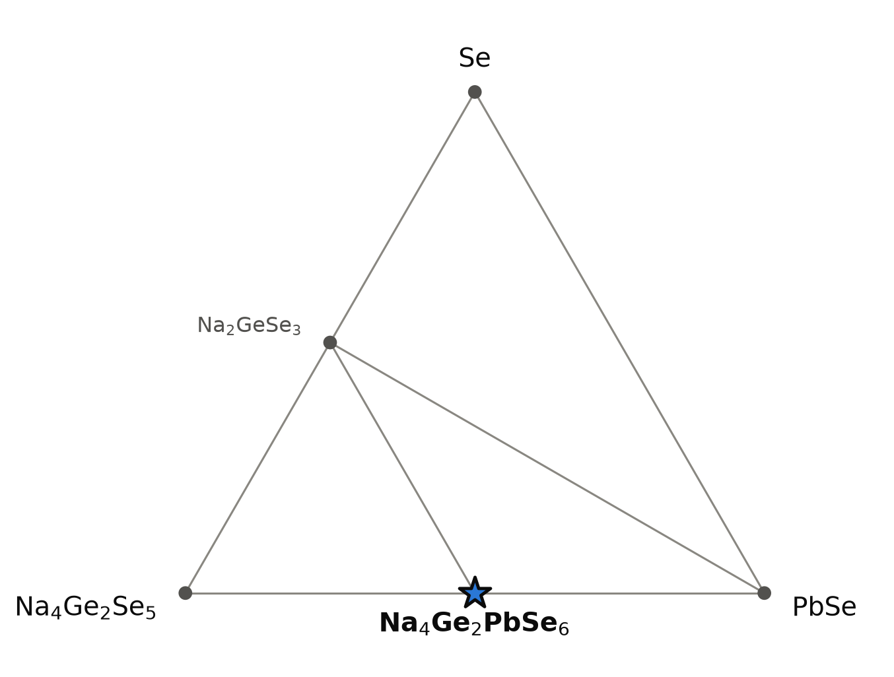
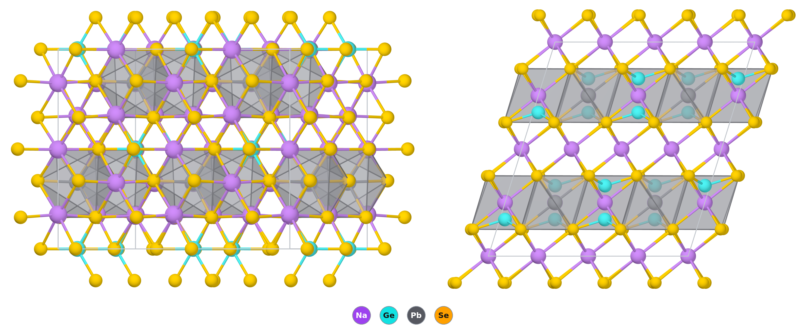

# Na₄PbGe₂Se₆ — a rock-salt superstructure with Ge–Ge dumbbells

*A Material a Day · entry 3 · 10 October 2026 · status: **predicted, no report found; close relatives are published***

> **In one paragraph.** Na₄PbGe₂Se₆ is a computed selenide in which every octahedral hole
> of a close-packed selenium lattice is filled: by sodium, by lead, or by a Ge–Ge
> dumbbell. The dumbbell and its six selenium neighbours form the ethane-like
> [Ge₂Se₆]⁶⁻ anion, with germanium formally trivalent. The sulfide Na₈Pb₂[Ge₂S₆]₂ and the
> selenosilicate Na₈Pb₂[Si₂Se₆]₂ were made in 1997; we found no report of the
> selenogermanate. It is computed to be a semiconductor with light electrons and a
> non-centrosymmetric structure, 15 meV/atom below its competitors, which is inside the
> error of such calculations. The obvious synthesis is the one that worked for its
> relatives; the calculation adds a route in which lead metal is both the reductant and
> the cation source.

Everything below is computed unless a reference is given. **Hazards:** lead and selenium
compounds are toxic, and sodium selenide releases H₂Se on contact with moisture.

## 1. Identity

| | |
|---|---|
| Formula | Na₄PbGe₂Se₆, also written Na₈Pb₂[Ge₂Se₆]₂ |
| Alexandria id | `agm020240419` |
| Space group | C2 (no. 5), Z = 2; non-centrosymmetric, chiral and polar |
| Cell (PBE) | a = 7.215 Å, b = 12.479 Å, c = 8.121 Å, β = 107.25° |
| Volume, density | 349.2 ų per formula unit, 4.37 g cm⁻³ |
| Formation energy | −0.786 eV/atom (PBE) |

The cell is metrically close to hexagonal: b/a = 1.730 ≈ √3, and the primitive cell has
a = b = 7.207 Å with γ = 119.93°. The CIF is [`Na4Ge2PbSe6.cif`](Na4Ge2PbSe6.cif).

## 2. Where it sits

<picture>
  <source media="(prefers-color-scheme: dark)" srcset="phase_diagram_dark.png">
  
</picture>

Four elements again, so the diagram is a section. No plane spanned by elements and
binary compounds passes through Na₄PbGe₂Se₆ without cutting tie lines, because germanium
is trivalent here and no binary germanium selenide is. The section that works has a
ternary corner: Na₄Ge₂Se₅–PbSe–Se. Every tie line shown is also one of the full
four-element hull.

| phase | position | energy below the corners (meV/atom) |
|---|---|---|
| Na₄Ge₂Se₅ | corner | 0 |
| PbSe | corner | 0 |
| **Na₄PbGe₂Se₆** | midpoint of the Na₄Ge₂Se₅–PbSe edge | 15 |
| Na₂GeSe₃ | midpoint of the Na₄Ge₂Se₅–Se edge | 18 |

- **The compound is a 1 : 1 adduct of PbSe and Na₄Ge₂Se₅**, both of which already
  contain the ingredients: Na₄Ge₂Se₅ is itself a Ge³⁺ selenide. Its only neighbours in
  the full hull are those two and Na₂GeSe₃.
- **Towards selenium, germanium oxidises.** Adding Se to Na₄Ge₂Se₅ gives Na₂GeSe₃ with
  Ge⁴⁺. A selenium-rich batch will therefore lose the Ge–Ge bond and with it the target.

## 3. Structure

*Left: one view of the close-packed layers. Right: seen along b; the grey slabs are the
layers that hold Pb and the Ge₂ dumbbells, separated by layers of sodium only.*

| site | Wyckoff | coordination |
|---|---|---|
| Na (×4) | 2a, 2a, 2a, 2b | 6 Se at 3.03–3.18 Å (octahedron) |
| Pb | 2b | 6 Se at 3.12–3.15 Å (octahedron) |
| Ge | 4c | 3 Se at 2.39 Å and 1 Ge at 2.455 Å (tetrahedron) |
| Se (×3) | 4c | 1 Ge + 4 Na + 1 Pb, or 1 Ge + 5 Na |

- **A filled rock-salt arrangement.** Selenium is close-packed and every octahedral
  hole is occupied. Per six selenium atoms there are six holes: four take Na⁺, one
  takes Pb²⁺ and one takes a Ge₂ pair.
- **The [Ge₂Se₆]⁶⁻ anion.** Two GeSe₃ pyramids joined by a Ge–Ge bond of 2.455 Å in a
  staggered, ethane-like arrangement. It is the germanium analogue of the [P₂Se₆]⁴⁻
  unit of the MPSe₃ layered compounds.
- **Layer order.** Layers containing only sodium alternate with layers containing
  sodium, lead and the dumbbells. Lead atoms are 7.21 Å apart on a triangular net.
- **Lead is in a regular octahedron,** with six nearly equal Pb–Se distances, as in
  PbSe itself: the 6s² pair is not stereochemically active.
- **No inversion centre.** The symmetry stays C2 at any tolerance we tried up to
  0.3 Å, so this is not a centrosymmetric structure in disguise.
- **A second arrangement** of the same building blocks (`agm020354057`, also C2) lies
  11 meV/atom higher.

**The family.** Eighty-nine compounds of this structure type are in the database, of
the general formula A₄M[T₂Q₆] with A = Na, K; M = Mg, Ca, Sr, Ba, Cd, Sn, Pb, Eu; T = Si,
Ge, Sn; Q = S, Se, Te. For the sodium lead members:

| | S | Se | Te |
|---|---|---|---|
| Si | 35 | 40 (published [1]) | 34 |
| Ge | 32 (published [1]) | **15** (this entry) | 7 |
| Sn | −23 | −18 | |

Depth below the competing phases, meV/atom, PBE; negative means above the hull. The
published members are the deepest of their rows, the tin compounds are not stable, and
this entry sits in between.

## 4. Properties

### Electronic structure

| | value | comment |
|---|---|---|
| Band gap, PBE (eV) | 1.32 (indirect), 1.32 (direct) | PBE underestimates; a real gap near 2 eV is the reasonable expectation, which would make the compound red to dark red |
| Band gap, machine-learned (eV) | 1.41 | A screening estimate of the PBE-level gap |
| Magnetism | none | closed shells |

Across the family the PBE gap falls from sulfide to telluride and from silicon to
germanium: Na₄PbSi₂S₆ 2.34, Na₄PbGe₂S₆ 1.87, Na₄PbSi₂Se₆ 1.95, Na₄PbGe₂Se₆ 1.32,
Na₄PbGe₂Te₆ 1.01 eV. No MBJ or hybrid gap is available.

### Charge transport (constant relaxation time)

| | electrons | holes |
|---|---|---|
| Conductivity mass at 300 K (mₑ) | 0.30 | 1.15 |
| Density-of-states mass (mₑ) | — | 2.4 |
| Seebeck coefficient at 300 K, 10¹⁹ cm⁻³ (μV/K) | −177 | +404 |
| Seebeck coefficient at 300 K, 10²⁰ cm⁻³ (μV/K) | −102 | +202 |

- **Light electrons, heavy holes.** A conductivity mass of 0.3 mₑ is in the range of
  ordinary semiconductors. The conduction band of a Pb²⁺ selenide is built from Pb 6p
  states, which explains the low mass; the valence band is selenium-based and flatter.
- **Branch-point energy:** 0.67 eV above the valence band in a 1.32 eV gap, that is,
  at mid-gap. Neither carrier type is favoured.
- Nothing is known about the scattering time, so these are not mobilities.

### Dielectric and optical

Not in the dielectric table. Because the structure has no inversion centre,
piezoelectricity and second-harmonic generation are allowed by symmetry; neither was
computed. The magnesium analogues of this family are in the database as well.

### Mechanical (machine-learned)

| bulk modulus | shear modulus | Young's modulus |
|---|---|---|
| 25 GPa | 12 GPa | 28 GPa |

A soft solid, comparable to rock salt, as expected for a sodium-rich selenide.

### Not computed

Phonons (not in our lattice-dynamics set), dielectric tensor, nonlinear optical
coefficients, defects.

## 5. Is it stable?

| calculation | depth below the competing phases (meV/atom) |
|---|---|
| PBE | 15.1 |
| PBE (MP settings) | 15.6 |

The two tables agree to half a meV, which is reassuring about consistency and says
nothing about accuracy. There is no calorimetric benchmark for selenides in our set;
for sulfides the scatter is about 80 meV/atom. **Fifteen is well inside that, so
stability is not established by the calculation.**

The argument for the compound is chemical: the same structure exists with sulfur in
place of selenium and with silicon in place of germanium [1], and this member is
computed to be as stable as the published ones to within a factor of two or three.

## 6. How to make it

Reaction energies at 0 K, meV per atom of the whole charge.

| route | charge | ΔE | comment |
|---|---|---|---|
| A | PbSe + Na₄Ge₂Se₅ | −16 | Fewest reagents and least driving force, but Na₄Ge₂Se₅ must be made first |
| **B** | **Pb + 2 Na₂GeSe₃** | **−85** | Lead metal reduces Ge⁴⁺ to Ge³⁺ and becomes the Pb²⁺ of the product. Nothing to separate |
| C | 2 Na₂Se + PbSe + 2 Ge + 3 Se | | The direct route from binaries and elements, as used for this family |
| D (metathesis) | 3 Na₂Se + PbCl₂ + 2 Ge + 3 Se → target + 2 NaCl | −341 | Clean in the calculation; NaCl is inert towards the product |
| E (metathesis) | Na₄Ge₂Se₆ + PbCl₂ | −122 | **Fails:** gives PbSe + GeSe₂ + 2 NaCl. A Ge⁴⁺ precursor has nothing to reduce it |

- **Route B is the one we would try.** It is a redox reaction in which the reductant
  ends up in the product. Na₂GeSe₃ is a Ge⁴⁺ selenide and easier to prepare and handle
  than a Ge³⁺ precursor.
- **Routes D and E together make the point about metathesis here:** it works only if
  the charge carries the reducing equivalents (elemental germanium), because the
  target contains a Ge–Ge bond that salt exchange alone cannot create.
- **Selenium balance decides the outcome** (section 2): excess selenium oxidises
  germanium and gives Na₂GeSe₃ + PbSe; too little leaves PbSe and germanium.

**In practice (a proposal).**

- **Container:** evacuated silica ampoule, carbon-coated for safety against sodium.
  Silica, alumina, boron nitride and graphite are inert towards the product in the
  calculation. Calcium oxide is not.
- **Temperature:** 600–750 °C for a few days, slow cooling. This is the usual range
  for alkali-metal chalcogenide reactions of this kind and is our judgement, not a
  computed window. PbSe (melting point 1078 °C) is the refractory component.
- **Flux:** all alkali chlorides, bromides and iodides are inert towards the compound
  in the calculation, so a NaCl-based or NaI-based flux is admissible, and the NaCl
  from route D does no harm. KF and K₂CO₃ exchange sodium for potassium. MgCl₂ and
  CaCl₂ destroy it.
- **Atmosphere:** none. With oxygen the computed products are sodium germanates, PbSe
  and sodium polyselenides (−637 meV/atom). Handle in a glovebox.

**Powder pattern.** Strongest computed lines, Cu Kα:

| 2θ (°) | 11.41 | 14.69 | 16.10 | 25.01 | 29.15 | 39.82 | 43.46 |
|---|---|---|---|---|---|---|---|
| hkl | 001 | 110 | 11-1 | 130 | 131 / 20-2 | 13-3 / 202 | 33-1 / 060 |
| I | 35 | 20 | 14 | 19 | 100 | 27 | 42 |

- **Lines of PbSe** (rock salt, a ≈ 6.12 Å) with a second sodium germanium selenide:
  the selenium content is off, or the compound does not form.
- **The 001 line at 11.4°** (d ≈ 7.76 Å) is the repeat of the sodium and
  lead/germanium layers and is the signature of the ordered structure.

## 7. What it might be good for

Nothing here is an existing application.

- **A semiconductor with a gap near the visible** and light electrons, built from
  abundant sodium; lead and selenium are the obvious objections.
- **Nonlinear optics.** Non-centrosymmetric chalcogenides with isolated [T₂Q₆] units
  are a known hunting ground for second-harmonic generation. The symmetry allows it
  here; the size of the effect is not computed.
- **A tunable family.** With 89 computed members and the gap moving from 1.0 to 2.3 eV
  across the sodium lead series alone, the structure type is a platform for choosing a
  gap by composition. Europium members are published and magnetic [2].

## 8. How this could be wrong

- **Stability is not resolved** (section 5).
- **The real symmetry may be higher.** A calculation at 0 K finds C2; cation disorder
  between Na and Pb at the synthesis temperature would average the structure towards a
  more symmetric one and remove the properties that depend on the missing inversion
  centre. We could not read the published structure reports of the sulfide and the
  selenosilicate to compare.
- **The gap is a PBE gap.** Spin–orbit coupling on lead, which is not included, lowers
  the conduction band and partly offsets the PBE underestimate.
- **Sodium and lead could mix** on the octahedral sites; the calculation assumes full
  order.

## 9. Literature

**Searched (OpenAlex, Crossref, web), 8 October 2026:** `Na8Pb2(Ge2Se6)2`,
`Na8Pb2[Ge2Se6]2`, `Na4PbGe2Se6`; "sodium lead selenogermanate Ge2Se6 ethane-like";
"quaternary thiostannates and thiogermanates Na8Pb2[Ge2S6]2"; "Na4MgM2Se6 nonlinear
optical".

**Result:** the sulfide and the selenosilicate are published [1]; no report of the
selenogermanate was found. This is a neighbour that a published study did not run, not
a claim of novelty: a check against ICSD by a person is still owed, and the full text
of [1] could not be retrieved, so it may mention the compound.

1. G. A. Marking, M. G. Kanatzidis, "The ethane-like [Ge₂S₆]⁶⁻ and [Si₂Se₆]⁶⁻ ligands
   bound to main-group metals in Na₈Pb₂[Ge₂S₆]₂, Na₈Sn₂[Ge₂S₆]₂ and Na₈Pb₂[Si₂Se₆]₂",
   *J. Alloys Compd.* (1997). doi:10.1016/s0925-8388(97)00038-8 — *title and metadata
   only; full text not retrievable.*
2. A. Choudhury, K. Ghosh, F. Grandjean *et al.*, "Structural, optical, and magnetic
   properties of Na₈Eu₂(Si₂S₆)₂ and Na₈Eu₂(Ge₂S₆)₂", *J. Solid State Chem.* (2015).
   doi:10.1016/j.jssc.2015.02.006 — *title and metadata only.*

## 10. Provenance

- **Data:** Alexandria database, tables `energy_runs_pbe` (structure, properties),
  `energy_runs_pbe_mp` (reaction energies), `el_transport_pbe`.
- **Tools:** the reaction-route code of this group, pymatgen, POV-Ray; machine-learned
  moduli from a graph neural network.
- **Authorship:** drafted by Claude (Anthropic) from those tools; reviewed by
  Miguel Marques. Corrections are welcome as issues on this repository.
