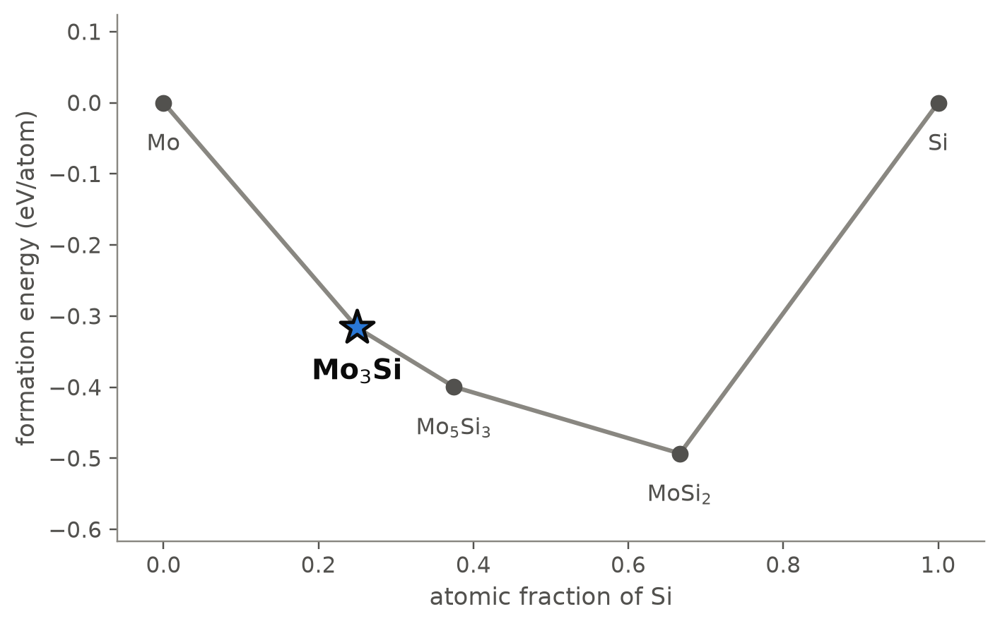
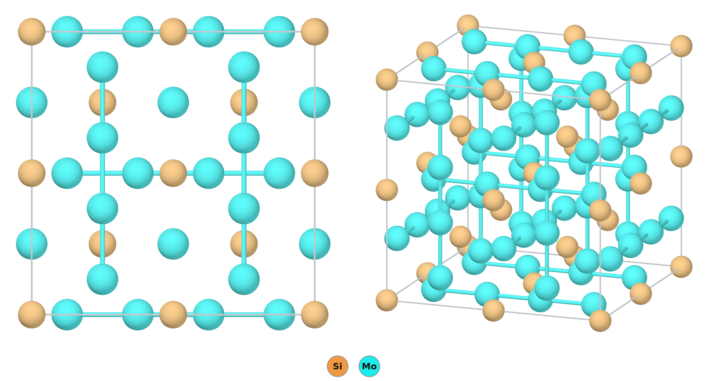
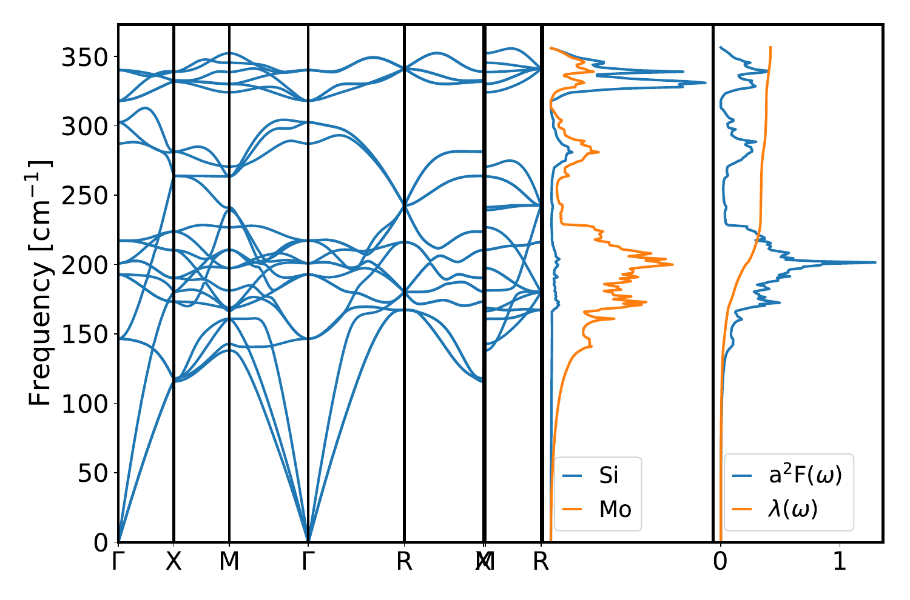

# Mo₃Si — an A15 silicide that superconducts at 1.7 K and matters at 1700 °C

*A Material a Day · entry 4 · 11 October 2026 · status: **known** (structure reported in 1954)*

> **In one paragraph.** Mo₃Si has the A15 structure of the classic superconductors Nb₃Sn
> and V₃Si: three sets of straight molybdenum chains running through a body-centred
> cubic lattice of silicon. It is the molybdenum-rich end of the Mo–Si system and one of
> the three phases of the Mo–Si–B alloys developed for use beyond nickel superalloys.
> It is a superconductor, but a weak one. Our electron-phonon calculation gives a
> coupling λ = 0.42 and a critical temperature of 1.6 K; the measured value is 1.7 K.
> The calculations get the cell right to 0.5 % and place the compound firmly on the
> hull, but they treat it as a line compound, which it is not: the real phase is
> slightly silicon-poor.

Computed numbers come from the Alexandria database and from our lattice-dynamics
calculations; measured numbers carry a reference.

## 1. Identity

| | computed | measured |
|---|---|---|
| Formula | Mo₃Si | single-phase near Mo–23 at.% Si [1] |
| Alexandria id | `agm003264320` | |
| Space group | Pm3̄n (no. 223), Z = 2 | Pm3̄n [2] |
| a (Å) | 4.905 (PBE); 4.863 (PBEsol) | 4.886–4.913 [2] |
| Density (g cm⁻³) | 8.89 (PBE) | |
| Structure type | A15, Cr₃Si | |
| Formation energy | −0.316 eV/atom (PBE) | |

The four measured cells in the Crystallography Open Database span 4.886 to 4.913 Å;
PBE lands inside that range and PBEsol 0.5 % below it. The CIF is [`SiMo3.cif`](SiMo3.cif).

## 2. Where it sits

<picture>
  <source media="(prefers-color-scheme: dark)" srcset="phase_diagram_dark.png">
  
</picture>

The Mo–Si system at 0 K (PBE table). Three compounds are on the hull, and they are the
three known molybdenum silicides.

| phase | at.% Si | formation energy (eV/atom) | structure |
|---|---|---|---|
| Mo | 0 | 0 | bcc |
| **Mo₃Si** | 25 | −0.316 | A15 |
| Mo₅Si₃ | 37.5 | −0.399 | W₅Si₃ type, I4/mcm |
| MoSi₂ | 66.7 | −0.493 | C11b, I4/mmm |
| Si | 100 | 0 | diamond |

Mo₃Si lies 50 meV/atom below the line joining Mo and Mo₅Si₃ (PBE), 65 in SCAN and 69
with Materials-Project settings.

## 3. Structure

*Left: seen along a cube axis. Right: an oblique view. Only the short Mo–Mo contacts are
drawn, to show the chains.*

| site | Wyckoff | x, y, z | neighbours |
|---|---|---|---|
| Si | 2a | 0, 0, 0 | 12 Mo at 2.742 Å (icosahedron) |
| Mo | 6c | ¼, 0, ½ | 2 Mo at 2.453 Å, 4 Si at 2.742 Å, 8 Mo at 3.004 Å |

- **Silicon** sits on a body-centred cubic lattice, each atom inside an icosahedron of
  twelve molybdenum atoms.
- **Molybdenum** forms three families of straight chains, along x, y and z, on the
  faces of the cube. They do not intersect.
- **The chains are tight.** The Mo–Mo distance along a chain is 2.453 Å, a/2, which is
  10 % shorter than in molybdenum metal (2.725 Å). This is the defining feature of the
  A15 type and the origin of the sharp structure in its electronic density of states.
- **Nothing else is close in energy.** Among the eighteen other structures of this
  composition in the database, the nearest is 166 meV/atom higher.

## 4. Properties

### Lattice dynamics and superconductivity

*Phonon dispersion, phonon density of states by element, and the Eliashberg function
α²F(ω) with the cumulative coupling λ(ω). Quantum ESPRESSO, density-functional
perturbation theory, PBEsol.*

| | computed (PBEsol) | measured |
|---|---|---|
| Dynamical stability | stable; no imaginary modes | |
| Top of the phonon spectrum | 355 cm⁻¹ (44 meV) | |
| Electron-phonon coupling λ | 0.42 | |
| Logarithmic average frequency ω_log | 293 K | |
| T_c, Allen–Dynes, μ* = 0.10 | 1.6 K | 1.7 K [3] |
| T_c for μ* = 0.12, 0.14, 0.16 | 1.0, 0.6, 0.3 K | |
| Zero-point energy | 43 meV/atom | |

- **A weak-coupling superconductor**, and the calculation says why. The silicon modes
  form a separate band at the top of the spectrum (320–355 cm⁻¹); the molybdenum modes
  below 300 cm⁻¹ carry most of the coupling, with the largest contribution near
  200 cm⁻¹. No soft mode is present.
- **Agreement with experiment is as good as it could be,** and partly luck: the result
  moves from 1.6 to 0.3 K across the usual range of the Coulomb parameter μ*.
- **Why Nb₃Sn reaches 18 K and Mo₃Si does not** is a matter of electron count: with
  one more electron per transition-metal atom the Fermi level sits away from the peak
  in the density of states that the chains produce. This is the textbook explanation;
  we did not compute the comparison.
- A graph-neural-network estimate from the structure alone gives λ = 0.40,
  ω_log = 284 K and T_c = 3.2 K: the right coupling, twice the critical temperature.

### Electronic and magnetic

A non-magnetic metal in PBE and in SCAN. Dielectric and semiconductor transport
quantities do not apply.

### Mechanical (machine-learned)

| bulk modulus | shear modulus | Young's modulus |
|---|---|---|
| 250 GPa | 135 GPa | 335 GPa |

Screening estimates from a graph neural network. They describe a stiff, hard
intermetallic, in line with the high microhardness and the creep resistance measured
for single-phase Mo₃Si [1].

### Not computed

Elastic constants, the upper critical field, anisotropy of the superconducting gap,
any property of the off-stoichiometric phase.

## 5. Is it stable?

Yes. The depth below Mo + Mo₅Si₃ is 50 to 69 meV/atom depending on the functional,
the phonons are stable, and no competing structure comes within 160 meV/atom.

What the calculation misses is the composition. It treats Mo₃Si as a line compound at
25 at.% Si. Annealing experiments at 1600 °C find a single phase at Mo–23 at.% Si,
while Mo–24 and Mo–25 at.% Si also contain Mo₅Si₃ [1]. The real phase is therefore
silicon-poor, with molybdenum on some silicon sites, and that needs defect
calculations which are not in the database.

## 6. How to make it

### What is done

Mo₃Si is made by melting or sintering the elements and annealing at high temperature;
the single-phase samples of [1] were annealed for 100 h at 1600 °C. In Mo–Si–B alloys
it forms together with the molybdenum solid solution and Mo₅SiB₂, by melting or by
mechanical alloying followed by sintering at about 1500 °C [4, 5]. As a thin film it
appears when sputtered Mo–Si films exceed 81 % molybdenum or are grown hot [6].

### What the calculation proposes

Reaction energies at 0 K, meV per atom of the whole charge.

| route | charge | ΔE | comment |
|---|---|---|---|
| A | 4 Mo + Mo₅Si₃ → 3 Mo₃Si | −69 | Least driving force; the reaction that removes Mo₅Si₃ from a silicon-rich batch |
| B | 5 Mo + MoSi₂ → 2 Mo₃Si | −136 | Uses the commercial silicide (heating-element material) as the silicon source |
| C | 3 Mo + Si | −325 | The route in use |
| D (thermite) | 3 MoO₃ + SiO₂ + 11 Mg → Mo₃Si + 11 MgO | −1369 | Clean in the calculation; violently exothermic |
| E (metathesis) | 3 MoCl₅ + Mg₂Si + 5.5 Mg → Mo₃Si + 7.5 MgCl₂ | −1071 | Clean in the calculation; the salt washes out |

- **Route C matches practice,** and it is the last of the three exact routes in our
  ranking (fewest reagents, then least driving force). The ranking prefers routes
  through other silicides; a furnace operator prefers the elements.
- **Routes D and E** are the low-temperature alternatives a hull can offer for a
  refractory intermetallic: both reach Mo₃Si with a by-product that is removed by
  leaching. They are self-propagating reactions and need dilution or a controlled
  ignition; the product would be a fine powder, not a dense body. We did not search
  for whether either has been tried for this compound.
- **Kinetics dominate.** Molybdenum melts at 2623 °C; solid-state interdiffusion
  below about 1300 °C is slow, which is why the annealing temperatures are so high.

### What it tolerates

| inert in the calculation | reacts |
|---|---|
| Al₂O₃, ZrO₂, MgO, CaO, Y₂O₃, SiO₂, BN, AlN, Si₃N₄, graphite | oxygen (→ SiO₂ + Mo), nitrogen (→ Si₃N₄ + molybdenum nitrides), CO₂ |
| Mo, Cu, Ag, Au | Pt, Ir, Pd, Rh (silicide formation); Ti, Zr, Ta, Nb, Ni, Co, Fe, Al |
| | Si (→ Mo₅Si₃ + MoSi₂), SiC (→ MoSi₂ + C) |

- **Oxygen takes the silicon first.** The computed reaction with a little oxygen is
  Mo₃Si + 2 O → SiO₂ + 3 Mo. This selective oxidation is the principle behind the
  silica-based protective scales of Mo–Si–B alloys [4]; the calculation does not
  contain the volatile MoO₃ that makes the intermediate-temperature range a problem.
- **Not platinum.** Platinum-group crucibles and thermocouples in contact with Mo₃Si
  form silicides. Oxide ceramics and molybdenum itself are the safe choices.

### Powder pattern

Computed, Cu Kα, PBE cell:

| 2θ (°) | 25.68 | 36.64 | 41.15 | 45.29 | 65.97 | 69.04 |
|---|---|---|---|---|---|---|
| hkl | 110 | 200 | 210 | 211 | 222 | 320 |
| I | 22 | 15 | 100 | 31 | 15 | 21 |

- **Lines of bcc molybdenum** (110 near 40.5°): the batch is silicon-poor beyond the
  homogeneity range.
- **Lines of Mo₅Si₃:** the batch is at or above 24 at.% Si. Aim for 23.

## 7. What it is used for

- **Ultra-high-temperature structural alloys.** Mo–Si–B alloys, built from a
  molybdenum solid solution, Mo₃Si and Mo₅SiB₂, are candidates to replace nickel-based
  superalloys in gas turbines, on the strength of their melting point,
  high-temperature strength and oxidation resistance [1, 4]. Low room-temperature
  toughness and oxidation at intermediate temperature are the open problems [4].
  Some alloy designs now try to suppress Mo₃Si in favour of Mo₅Si₃ [5].
- **Superconducting films.** The technologically important Mo–Si superconductor is the
  amorphous alloy, used in single-photon detectors with a critical temperature up to
  8 K; crystalline Mo₃Si is the phase to avoid there [6].
- **As a superconductor in its own right** Mo₃Si is of interest mainly as the
  low-T_c member that tests the understanding of the A15 family.

## 8. How this could be wrong

- **Stoichiometry.** Everything computed is for ideal Mo₃Si; the real phase is
  silicon-deficient (section 5).
- **The agreement in T_c is not a prediction to 0.1 K.** The Allen–Dynes formula is
  isotropic and the Coulomb parameter is chosen, not computed.
- **The measured T_c** is taken from a compilation in which the entry's title and DOI
  do not obviously match; values near 1.3 K are also quoted for this compound.
- **Two functionals are mixed:** phonons in PBEsol, energies in PBE.
- **Routes D and E** ignore the heat they release and the gases a real charge evolves.

## 9. Literature

**Searched (OpenAlex, Crossref), 8 October 2026:** "Mo3Si A15 superconductivity
transition temperature"; "Mo3Si off-stoichiometry A15 mechanical properties
oxidation"; "Mo-Si-B alloys Mo3Si Mo5SiB2 review".

1. O. Kauss *et al.*, "Temperature resistance of Mo₃Si: phase stability, microhardness,
   and creep properties", *Metals* 11, 564 (2021). doi:10.3390/met11040564 —
   *abstract read.*
2. H. Nowotny, R. Machenschalk, R. Kieffer *et al.*, "Untersuchungen an
   Silizidsystemen", *Monatsh. Chem.* 85, 241 (1954), a = 4.886 Å; three later
   determinations give 4.889, 4.893 and 4.913 Å — *cells from COD entries 1538778,
   1539541, 1539176 and 4031680.*
3. Measured T_c of 1.7 K as listed in our compilation of experimental critical
   temperatures, which cites doi:10.1103/PhysRevB.97.054515 — *not opened.*
4. Y. Kong *et al.*, "Review of research progress on Mo–Si–B alloys", *Materials* 16,
   5495 (2023). doi:10.3390/ma16155495 — *abstract read.*
5. T. Yang, X. Guo, "Effects of Nb content on the mechanical alloying behavior and
   sintered microstructure of Mo–Nb–Si–B alloys", *Metals* 9, 653 (2019).
   doi:10.3390/met9060653 — *abstract read.*
6. S. Grotowski *et al.*, "Optimizing the growth conditions of superconducting MoSi
   thin films for single photon detection", *Sci. Rep.* (2025).
   doi:10.1038/s41598-025-86303-5 — *abstract read.*

## 10. Provenance

- **Data:** Alexandria database, tables `energy_runs_pbe`, `energy_runs_pbe_mp`,
  `energy_runs_scan`; the group's phonon and electron-phonon calculations (Quantum
  ESPRESSO, PBEsol); measured cells from the Crystallography Open Database.
- **Tools:** the reaction-route code of this group, pymatgen, POV-Ray; machine-learned
  moduli and T_c from graph neural networks.
- **Authorship:** drafted by Claude (Anthropic) from those tools; reviewed by
  Miguel Marques. Corrections are welcome as issues on this repository.
