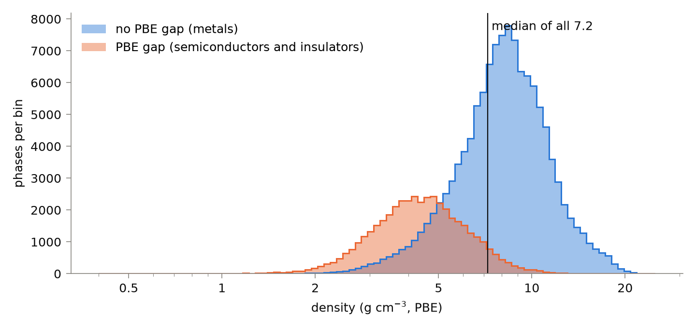
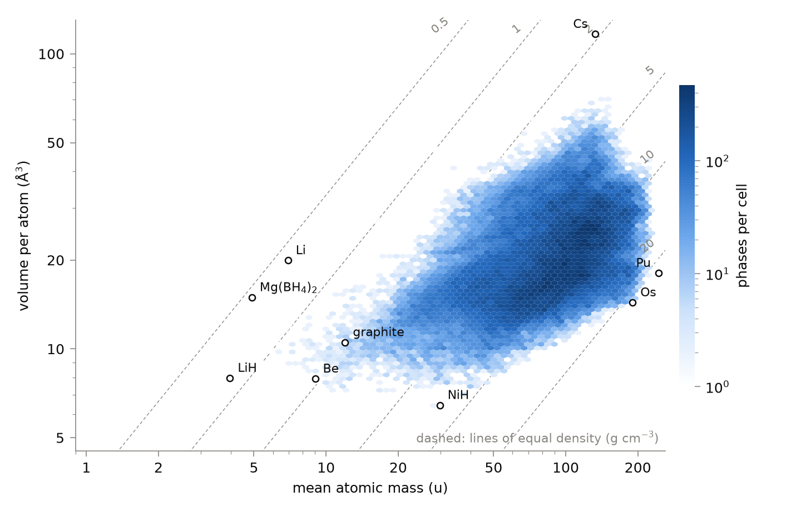
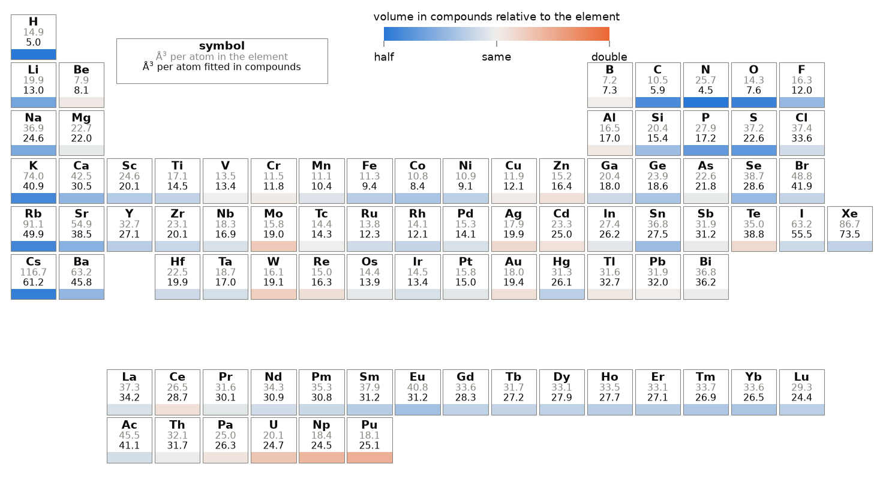
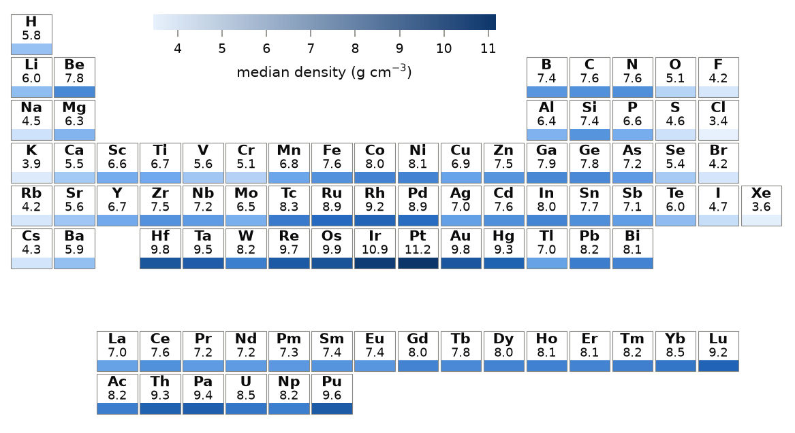
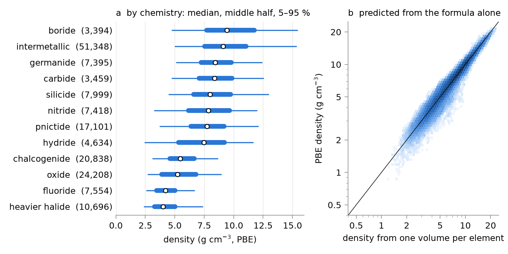
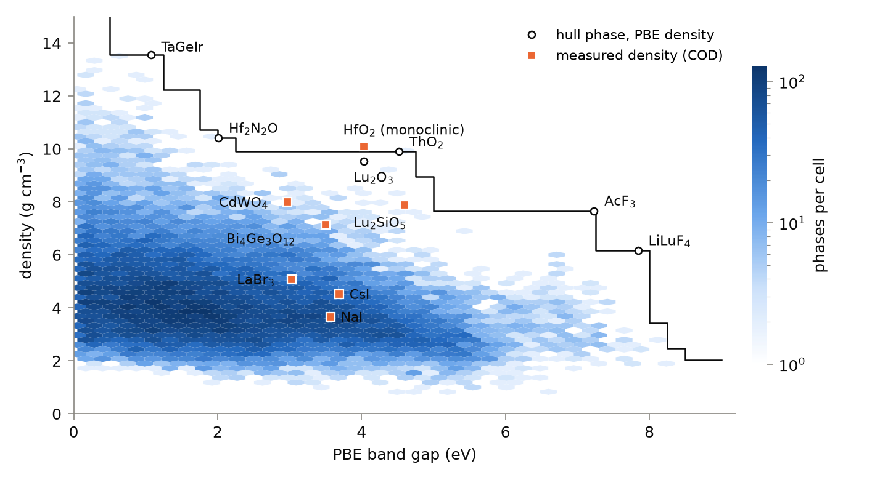
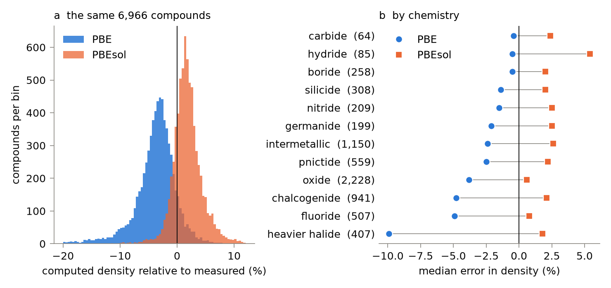

# Density: 166,133 stable compounds, one number each

*A Property a Month · no. 1 (pilot) · October 2026*

> **In one paragraph.** We computed the mass density of every phase on the PBE convex
> hull of the Alexandria database. The median is 7.2 g cm⁻³ and nine phases in ten lie
> between 3.1 and 13.0 g cm⁻³. Density is set mostly by how heavy the atoms are, not by
> how closely they pack: volume per atom varies by a factor of three across the hull,
> mean atomic mass by a factor of five, and the two rise together, which narrows the
> range. One fitted volume per element predicts the density of a compound from its
> formula with a median error of 5 %. For the 8,543 compounds with a measured cell PBE is 3.4 % too light in the
> median and PBEsol 1.6 % too dense, and the PBE error reaches 10 % in chlorides,
> bromides and iodides.

Computed numbers come from the Alexandria database; measured numbers come from cells in
the Crystallography Open Database (COD) or carry a reference. Every number below is in
[`numbers.json`](numbers.json) or [`tables.json`](tables.json), and
[`survey.py`](survey.py) reproduces them.

## 1. What was surveyed

- **The set.** All 166,133 phases with zero distance to the hull in `energy_runs_pbe`
  (PBE, 0 K, 0 GPa): 89 elements, 7,426 binaries, 81,825 ternaries, 70,246 quaternaries
  and 6,547 phases with five to seven elements. One phase per composition.
- **The number.** Density is the mass of the cell contents divided by the relaxed cell
  volume. It is a 0 K number without zero-point motion.
- **The threshold does not matter much.** Admitting everything within 25, 50 or 100 meV
  per atom of the hull gives 0.64, 1.0 and 1.4 million phases with medians of 7.06,
  7.07 and 7.09 g cm⁻³.
- **This is a census of a database, not of nature.** Its composition reflects which
  chemical systems and structure types were searched: 31 % of the hull is intermetallic
  and 74 % has no PBE gap. The "typical material" below is typical of this hull.

## 2. The typical material

<picture>
  <source media="(prefers-color-scheme: dark)" srcset="fig1_distribution_dark.png">
  
</picture>

*Figure 1. Density of the 166,133 hull phases on a logarithmic axis, separately for the
phases without and with a PBE gap. The two histograms are overlaid, not stacked.*

| | 1 % | 5 % | 25 % | median | 75 % | 95 % | 99 % |
|---|---|---|---|---|---|---|---|
| density (g cm⁻³) | 2.29 | 3.10 | 5.06 | **7.20** | 9.26 | 12.97 | 16.62 |
| volume per atom (ų) | 9.8 | 12.1 | 15.9 | **19.9** | 26.1 | 36.1 | 45.0 |
| mean atomic mass (u) | 20 | 32 | 62 | **90** | 122 | 167 | 192 |

The median phase is a metallic ternary with ten atoms in the cell, 20 ų per atom, a
mean atomic mass of 90 u and a density of 7.2 g cm⁻³, about that of zinc (7.15 in PBE).
The distribution has two populations. The 74 % of phases without a PBE gap have a
median of 8.2 g cm⁻³; the 26 % with a gap have a median of 4.4 g cm⁻³ and form the
separate, lower peak on the left of Figure 1.

The difference is one of mass and not of packing. The two populations have the same
median volume per atom, 19.9 ų, and median atomic masses of 102 u without a gap and
57 u with one. A gap needs filled bands separated from empty ones,
and on this hull that is reached mostly by letting an electronegative element take up
the valence electrons of the metals: 87 % of the gapped phases are oxides, fluorides,
other halides or chalcogenides, against 21 % of the metallic ones. Oxygen, fluorine,
sulfur and chlorine are light, and that is where the mass goes. It is a statement about
which compounds are common and not a requirement: silicon and the
half-Heusler TaGeIr of section 5 have gaps without any such element, and intermetallics
make up 1.4 % of the gapped phases. The anions are not small
(the fitted volume of oxygen is 7.6 ų against 9.4 for iron, and sulfur and
chlorine take 23 and 34; section 3), so the volume per atom does not change while
the mass per atom falls. The same
holds inside each class: the gapped oxides have a median mass of 45 u and the metallic
oxides 63 u, at the same 15 ų per atom.

Density also falls with the number of elements, from
7.8 g cm⁻³ for binaries and ternaries to 6.7 for quaternaries and 4.5 for quinaries,
because the many-element phases in the database are mostly oxides and halides.

## 3. Mass decides, volume resists

<picture>
  <source media="(prefers-color-scheme: dark)" srcset="fig2_mass_volume_dark.png">
  
</picture>

*Figure 2. Every hull phase by mean atomic mass and volume per atom. Density is constant
along the dashed diagonals.*

Density is mean atomic mass divided by volume per atom, so on logarithmic axes the two
contributions add. The variance of ln ρ over the hull is 0.19. Mass alone contributes
0.26 and volume 0.12, and their covariance removes 2 × 0.09: heavy atoms are also large
atoms (correlation 0.53), and this cancels half of what the two would produce if they
were independent. What is left follows mass (correlation of ln ρ with ln mass 0.75)
and hardly follows volume (−0.17). To a first approximation a dense compound is a
compound of heavy atoms, and a tightly packed one is not necessarily dense.

The corners of Figure 2 show the limits. Caesium has the largest volume per atom on the
hull (117 ų) and the interstitial hydrides the smallest (VH₂ 6.2, NiH 6.4 ų). Osmium
and iridium sit at the lower right, where a heavy atom occupies 14 ų.

**One volume per element.** If each element is given a single volume, fitted by least
squares to four fifths of the hull, the density of the remaining 33,257 phases is
reproduced with a median error of 4.6 %, and 80 % of them within 10 % (Figure 5b). The
idea is old: Hofmann [5] derived average atomic volumes from the Cambridge Structural
Database to estimate the densities of molecular crystals. It works best for silicides,
germanides and intermetallics (2 to 4 %) and worst for oxides and fluorides (10 %),
where the volume depends on coordination and not only on composition.

<picture>
  <source media="(prefers-color-scheme: dark)" srcset="fig3_atomic_volumes_dark.png">
  
</picture>

*Figure 3. Volume per atom (ų) of each element in its own PBE hull phase (grey) and
the single volume fitted to its hull compounds (black). The bar shows the ratio: blue
where the atom takes less room in compounds than in the element, orange where it takes
more. Elements in fewer than 20 hull phases
are left out.*

The fitted volumes are not those of the elements (Figure 3). Oxygen takes 7.6 ų in a compound
against 14.3 ų in PBE solid O₂, nitrogen 4.5 against 25.7, caesium 61 against 117 and
potassium 41 against 74, while osmium keeps 13.9 of its 14.4 ų. The alkali metals lose a third to a half of their volume. Among the non-metals the
loss runs from nothing for boron and 10 % for chlorine to 47 % for oxygen, 66 % for
hydrogen and 82 % for nitrogen. The transition metals stay within about 20 % of their
elemental volume. A few atoms take more room in compounds than in
the element: molybdenum and tungsten by about 20 %, and uranium, neptunium and
plutonium by 23 to 39 %, the last partly because PBE makes those elements too compact
(section 5). A hull compound
occupies in the median 83 % of the volume of its elements: 92 % for intermetallics,
67 % for oxides and 57 % for nitrides. The molecular elements make the last two numbers
look more dramatic than they are, since PBE has no dispersion to hold solid O₂ and N₂
together (section 6).

## 4. Chemistry

<picture>
  <source media="(prefers-color-scheme: dark)" srcset="fig4_elements_dark.png">
  
</picture>

*Figure 4. Median density (g cm⁻³) of the hull phases that contain each element.
Elements in fewer than 20 hull phases are left out.*

<picture>
  <source media="(prefers-color-scheme: dark)" srcset="fig5_classes_additive_dark.png">
  
</picture>

*Figure 5. (a) Density by chemical class, with the number of phases. A compound is
named after the most electronegative non-metal it contains; "intermetallic" means none
of H, B, C, N, O, F, Si, P, S, Cl, Ge, As, Se, Br, Sb, Te or I. (b) Density predicted
from one volume per element against the PBE density, for all hull phases.*

| class | phases | median (g cm⁻³) | 5–95 % | ų per atom | mean mass (u) | no PBE gap |
|---|---|---|---|---|---|---|
| heavier halide (Cl, Br, I) | 10,696 | 4.0 | 2.4–7.4 | 33.8 | 86 | 41 % |
| fluoride | 7,554 | 4.2 | 2.6–6.7 | 16.7 | 43 | 22 % |
| oxide | 24,208 | 5.2 | 2.7–8.9 | 15.3 | 50 | 32 % |
| chalcogenide (S, Se, Te) | 20,838 | 5.5 | 3.1–8.6 | 28.5 | 96 | 55 % |
| hydride | 4,634 | 7.5 | 2.5–11.7 | 14.3 | 63 | 76 % |
| pnictide (P, As, Sb) | 17,101 | 7.7 | 3.7–12.1 | 21.9 | 101 | 89 % |
| nitride | 7,418 | 7.8 | 3.3–12.0 | 15.3 | 77 | 76 % |
| silicide | 7,999 | 8.0 | 4.5–13.0 | 17.5 | 85 | 99 % |
| carbide | 3,459 | 8.4 | 4.8–12.5 | 16.6 | 88 | 99 % |
| germanide | 7,395 | 8.4 | 5.1–12.4 | 19.3 | 98 | 99 % |
| intermetallic | 51,348 | 9.1 | 5.0–15.3 | 21.1 | 121 | 99 % |
| boride | 3,394 | 9.4 | 4.8–15.4 | 12.7 | 72 | 99 % |

The two halide rows show the argument of section 3 in miniature. Fluorides and heavier
halides have the same density, 4.0 and 4.2 g cm⁻³, and reach it in opposite ways: the
heavier halides have twice the mass per atom and twice the volume. Borides are the
densest class although boron is light, because the hull borides are mostly compounds
of 4d and 5d metals and boron adds little volume (12.7 ų per atom, the smallest in
the table). The hydride row is wide for the same reason: it runs from the borohydrides
to hydrides of platinum-group metals.

In Figure 4 the 5d metals from hafnium to gold and the actinides carry the densest
compounds (platinum 11.2, iridium 10.9 g cm⁻³), and chlorine (3.4), potassium (3.9)
and the other halogens and heavy alkali metals the lightest. Caesium is as heavy as a
lanthanide and its compounds have a median density of 4.3 g cm⁻³.

## 5. The extremes

**Densest.** The top of the list is plutonium (22.43 g cm⁻³), and its place there
should not be trusted. Two COD cells of the same structure give 20.2 g cm⁻³, so PBE is
11 % too dense. That is about three times the typical PBE error and in the unusual
direction, since PBE is too light for nine compounds in ten (section 6); it is enough
to lift plutonium above osmium, iridium, rhenium and neptunium, which are all denser
in the measured cells. The difficulty of describing the 5f electrons of plutonium
within DFT is long known [6]. After it come osmium (22.00), iridium (21.97) and twelve ordered
Os–Ir–Re–W–Pt–Rh alloys between 21.4 and 22.0 g cm⁻³. IrOs₂ is nominally above osmium, by
0.1 %, with 1 meV per atom of stability; neither margin means anything. The measured
cells give 22.65 g cm⁻³ for osmium (four cells) and 22.56 for iridium (three), so PBE
is 3 % light on both and keeps the order, although a gap of 0.1 % is more than twenty
times smaller than its error. Arblaster [4] concludes from the measured lattice parameters
that osmium is the denser of the two at ambient pressure.

**Lightest.** Phases made only of non-metals (580 of them, such as H₂, CH₄ and NH₃)
are left out here: most are gases or liquids at room temperature. Of the rest, the
lightest are the borohydrides: Mg(BH₄)₂ at 0.55 g cm⁻³, Be(BH₄)₂ at 0.56, LiBH₄ at
0.68. The Mg(BH₄)₂ on the hull is a cubic framework of 132 atoms per cell; a highly
porous cubic form of this compound is known [7], and the three COD cells of the denser
forms give 0.76 to 0.78 g cm⁻³. Lithium is the lightest metal (0.58), BeH₂ the
lightest binary compound (0.67) and Li₇Mg the lightest intermetallic (0.76).

| class | densest on the hull (g cm⁻³) | lightest on the hull (g cm⁻³) |
|---|---|---|
| intermetallic | IrOs₂ 22.0, IrOs₃ 22.0 | Li₇Mg 0.76, KNa₂ 0.98 |
| boride | U₄BOs₁₂ 20.0, Hf₂BIr₆ 19.1 | LiB 1.31, LiBeB 1.43 |
| nitride | PuNpN 19.1, Re₃N 19.0 | LiBH₇N 0.69, NaBH₇N 0.78 |
| carbide | Pa₂Os₆C 19.0, Re₂C 18.1 | KC₈ 1.96, LiC₁₂ 2.08 |
| oxide | Hf₉Re₄O₃ 15.1, Hf₆O 13.2 | K₉O₂ 1.14, K₄O 1.22 |
| chalcogenide | Np₂Se 15.6, Pa₇Te 14.7 | Be₄H₆S 0.95, NaHS 1.36 |
| fluoride | Pa₆C₅F 12.4, Th₆C₅F 10.6 | BeF₂·2NH₃ 1.41, NH₄BeF₃ 1.56 |

Most of the dense records contain plutonium, neptunium or protactinium, which are
radioactive and carry the same 5f uncertainty as the element. Beryllium compounds are
toxic.

**Dense and transparent.** Scintillators and radiation shields need a heavy lattice
with a wide gap, and the two pull against each other.

<picture>
  <source media="(prefers-color-scheme: dark)" srcset="fig6_gap_dark.png">
  
</picture>

*Figure 6. Density against PBE gap for the hull phases with a gap and no open f shell
(compounds of Ce–Yb and Pa–Pu are left out, since their PBE gaps are artefacts). Blue:
PBE densities of the hull phases; the line is the densest phase at or above each gap.
Orange squares: measured densities (COD) of six scintillator hosts in use and of
monoclinic HfO₂, each placed at the PBE gap of the measured structure.*

| PBE gap at least | densest hull phases (g cm⁻³) |
|---|---|
| 1 eV | TaGeIr 13.6, TaGaPt 13.3, LiTaGaIr 12.8 |
| 2 eV | Hf₂N₂O 10.4, ThH₆Os 10.3 |
| 4 eV | Lu₄Hf₃O₁₂ 9.9, ThO₂ 9.9, AcLuO₃ 9.7, Lu₂O₃ 9.5 |
| 5 eV | AcF₃ 7.7, LuBO₃ 7.4, Th₃TlF₁₃ 7.0, HfF₄ 6.9 |
| 7 eV | AcF₃ 7.7, LiLuF₄ 6.2, LuF₃ 5.0 |

PBE underestimates gaps, so the real thresholds lie higher; the ranking is the useful
part. Thorium and actinium compounds are radioactive, and actinium is of no practical
use. Without them the front is held by hafnium and lutetium. The three COD cells of
ThO₂ give 9.99 to 10.03 g cm⁻³ against 9.90 computed. The LuF₃ in the table is a
cubic phase (Pm3̄m); whether that is the measured structure was not checked.

**Against what is used today.** Absorption of X-rays and γ-rays grows with density
and steeply with atomic number, and the review of Yanagida [8] names the hosts in
service: NaI and CsI since the middle of the last century, Bi₄Ge₃O₁₂ in the first PET scanners, Ce-doped
Lu₂SiO₅ and its yttrium-containing variant in current ones, Gd₂O₂S in medical X-ray
CT, CdWO₄ in security scanners and LaBr₃ where energy resolution matters, with lead or
tungsten as collimators. The same compounds in our tables, and as orange squares in
Figure 6:

| host | use [8] | computed (g cm⁻³) | measured, COD (g cm⁻³) | PBE gap (eV) | on the hull |
|---|---|---|---|---|---|
| NaI | long established | 3.57 | 3.67 | 3.6 | yes |
| CsI | long established | 4.23 | 4.53 | 3.7 | no: 32 meV/atom above a rock-salt phase of 3.55 g cm⁻³ |
| LaBr₃ | high energy resolution | 4.87 | 5.07 | 3.0 | yes |
| Bi₄Ge₃O₁₂ | early PET | 6.84 | 7.10, 7.15 (a third cell: 7.87) | 3.5 | yes |
| Gd₂O₂S | medical X-ray CT | 7.25 | 7.33, 7.34 | open 4f | yes |
| Lu₂SiO₅ | current PET | 7.69 (P2₁/c) | 7.89 (P2₁/c); 7.39, 7.40 (C2/c) | 4.6 | no: 10 meV/atom above; C2/c not in the database within 100 meV |
| CdWO₄ | security X-ray | 7.62 | 7.96–8.39 (nine cells) | 3.0 | yes |
| Pb | collimator | 10.77 | 11.34–11.62 (seven cells) | metal | yes |

The hosts in service span 3.6 to 8 g cm⁻³. Of the 8,898 hull phases with a PBE gap of
at least 3 eV and no open f shell, 84 are denser than CdWO₄, 54 exceed 8 g cm⁻³ and 11
exceed 9 g cm⁻³. Leaving out thorium and actinium, the densest are Lu₄Hf₃O₁₂ (9.9),
Lu₆WO₁₂ (9.7), Lu₂WO₆ (9.7), Lu₂O₃ (9.5), LuHO (9.4), LuTaO₄ (9.3; one COD cell gives 9.75),
Hf₃N₂O₃ (9.1), Lu₂SO₂ (9.0) and LuOF (8.8). Lu₂O₃ is not a discovery of this list: the
same review describes doped Lu₂O₃ and (Lu,Gd)₂O₃ as scintillators under study [8]; its
four COD cells in the hull structure give 9.01 to 9.41 g cm⁻³, all below the computed
9.53, which is unusual for PBE and unexplained. For Lu₄Hf₃O₁₂ as a
scintillator host no report was found in one search (OpenAlex, "Lu4Hf3O12 scintillator
ceramic lutetium hafnate"), which says little.

Two cautions on the ranking. HfO₂ is missing from the front because the phase on
the hull is not the measured one: it is a tetragonal one (I4₁/amd) of 8.25 g cm⁻³, while the
measured monoclinic phase lies 6 meV per atom above it with a computed density of
10.0 g cm⁻³ (COD: 9.92 to 10.11) and a PBE gap of 4.0 eV, which would put it first.
And density with a gap is only the entry ticket: a scintillator also needs an
activator site, a high light yield and a fast decay [8], none of which this survey
addresses.

## 6. How good are the numbers

<picture>
  <source media="(prefers-color-scheme: dark)" srcset="fig7_calibration_dark.png">
  
</picture>

*Figure 7. Computed density relative to the density of measured cells with the same
composition and space group. (a) The 6,966 compounds for which both PBE and PBEsol
structures exist. (b) Median error by class, with the number of compounds.*

Of the 69,325 COD records read, 43,781 give a usable cell (integer occupancies,
ambient pressure or none stated). Of the hull phases, 8,543 have at least one measured cell
with the same composition and the same space group, 13,484 cells in all.

| | PBE | PBEsol |
|---|---|---|
| compounds | 8,543 | 6,966 |
| median computed / measured | 0.966 | 1.016 |
| 5–95 % | 0.884–1.015 | 0.982–1.065 |
| median absolute error | 3.5 % | 1.9 % |
| within 5 % of measured | 70 % | |
| within 10 % of measured | 93 % | |

- **PBE is too light in 90 % of the compounds**, by 3.4 % in the median. This is the
  known overestimate of volumes: Lejaeghere et al. [1] found 3.6 % for the elemental
  crystals after correcting the measurements to 0 K. Our measured cells are mostly at
  room temperature, where the real cell is larger, so part of the error is hidden.
- **The error depends on the chemistry** (Figure 7b): 0.5 % for borides and carbides,
  2 % for intermetallics, 4 % for oxides, 5 % for fluorides and chalcogenides and 10 %
  for the heavier halides, where layers and molecules are held by dispersion that PBE
  lacks. The 5 % tail of the heavier halides is 25 % too light.
- **PBEsol is 1.6 % too dense** and has half the absolute error. The PBEsol cells
  are those of `energy_runs_ps`, the dataset of Schmidt et al. [9]. On the same phase
  the PBEsol density is 5.0 % above the PBE one in the median (33,165 phases).
  Kingsbury et al. [2] compared PBEsol, SCAN and r²SCAN volumes with measured ones and
  found a mean absolute error of 0.89 to 0.97 ų per atom for PBEsol, which is about
  5 % of our median volume; it is a mean and ours is a median, so the two are not
  directly comparable.
- **The measurements scatter too.** For the 1,659 compounds with several cells, the
  densest and the lightest differ by 0.8 % in the median and by more than 6.5 % for
  one compound in ten. Both tails of Figure 7a contain COD records with a wrong cell
  content and cells measured under pressure without a pressure entry.
- **The retiring table agrees.** For the 120,976 hull phases also on the hull of
  `energy_runs_pbe_mp` the two PBE densities agree to 0.01 % in the median, and 90 %
  lie between −1.4 % and +2.2 %.

Even the best classes are off by about 0.5 % in the median, and for a single compound
the honest uncertainty of a PBE density is the 5–95 % range: from 12 % too light to
1.5 % too dense.

## 7. Is the stable phase the dense one?

For molecular crystals Burger and Ramberger's density rule says that the stable
polymorph at 0 K is usually the densest [3]. The database allows a test on inorganic
solids: 59,511 hull compositions have other phases within 100 meV per atom, 158,635 in
all.

| distance above the hull | phases | less dense than the hull phase | median change in density |
|---|---|---|---|
| 0–10 meV/atom | 41,943 | 56 % | −0.04 % |
| 10–25 | 42,282 | 58 % | −0.15 % |
| 25–50 | 39,877 | 61 % | −0.4 % |
| 50–100 | 34,533 | 62 % | −0.8 % |

The rule holds as a tendency and no more. A metastable phase is less dense than the
hull phase 59 % of the time, and the hull phase is the densest of its set for only
44 % of the compositions. PBE has no dispersion and can favour an open structure over the dense one that is
measured (CsI and HfO₂ in section 5 are examples): it penalises
dense phases, so a functional with dispersion should make the rule look better.

## 8. Limits

- PBE at 0 K, no zero-point motion, no thermal expansion, perfect stoichiometry and
  full occupancy. Measured densities of real samples also include vacancies and pores.
- The phase on the hull is not always the measured one. CsI and HfO₂ in section 5 are
  two cases where the measured structure lies 32 and 6 meV per atom higher and is
  about 20 % denser.
- Molecular and layered solids are unreliable at the 10 to 30 % level (section 6).
- Elemental cerium, plutonium and other open-f metals carry errors of 10 % and more.
- "Same composition and space group" is a loose test of "same structure". For the
  elements it fails visibly: graphite and hexagonal diamond share a space group.
- The metal and non-metal split uses the PBE gap, which is zero for some real
  semiconductors.
- The fitted atomic volumes are averages over the oxidation states and coordinations
  that this hull happens to contain.

## 9. Sources

1. K. Lejaeghere, V. Van Speybroeck, G. Van Oost, et al., "Error estimates for
   solid-state density-functional theory predictions: an overview by means of the
   ground-state elemental crystals", *Crit. Rev. Solid State Mater. Sci.* (2013).
   doi:10.1080/10408436.2013.772503 — *arXiv version, parts read.*
2. R. Kingsbury et al., "Performance comparison of r²SCAN and SCAN metaGGA density
   functionals for solid materials via an automated, high-throughput computational
   workflow", *Phys. Rev. Materials* 6, 013801 (2022).
   doi:10.1103/PhysRevMaterials.6.013801 — *accepted manuscript, parts read.*
3. A. Burger, R. Ramberger, "On the polymorphism of pharmaceuticals and other
   molecular crystals. I", *Mikrochim. Acta* (1979). doi:10.1007/BF01197379 —
   *metadata only; the rule is quoted as it is commonly stated.*
4. J. W. Arblaster, "Is osmium always the densest metal?", *Johnson Matthey Technol.
   Rev.* 58, 137 (2014). doi:10.1595/147106714X682337 — *abstract read.*
5. D. W. M. Hofmann, "Fast estimation of crystal densities", *Acta Cryst. B*
   (2002). doi:10.1107/S0108768101021814 — *abstract read.*
6. B. Sadigh et al., "Ab initio calculations for void swelling bias in α- and
   δ-plutonium", *Phys. Rev. Materials* 6, 045005 (2022).
   doi:10.1103/PhysRevMaterials.6.045005 — *arXiv version, introduction read.*
7. Y. Filinchuk et al., "Porous and dense magnesium borohydride frameworks: synthesis,
   stability, and reversible absorption of guest species", *Angew. Chem. Int. Ed.*
   (2011). doi:10.1002/anie.201100675 — *abstract read; the density of the
   porous form was not retrieved.*
8. T. Yanagida, "Inorganic scintillating materials and scintillation detectors",
   *Proc. Jpn. Acad. Ser. B* (2018). doi:10.2183/pjab.94.007 — *full text, parts read.*
9. J. Schmidt, H.-C. Wang, T. F. T. Cerqueira, et al., "A dataset of 175k stable and
   metastable materials calculated with the PBEsol and SCAN functionals", *Sci. Data*
   (2022). doi:10.1038/s41597-022-01177-w — *abstract read.*

Measured cells: Crystallography Open Database, https://www.crystallography.net/cod/.

## 10. Provenance

- **Data:** Alexandria database, tables `energy_runs_pbe`, `energy_runs_ps` (PBEsol) and
  `energy_runs_pbe_mp`, read on 9 October 2026; 69,325 COD records.
- **Tools:** [`survey.py`](survey.py) in this folder (pymatgen, SciPy, Matplotlib).
- **Owed:** measured densities at low temperature for the elemental comparison.
- **Authorship:** drafted by Claude (Anthropic) from those tools; reviewed by
  Miguel Marques. Corrections are welcome as issues on this repository.
